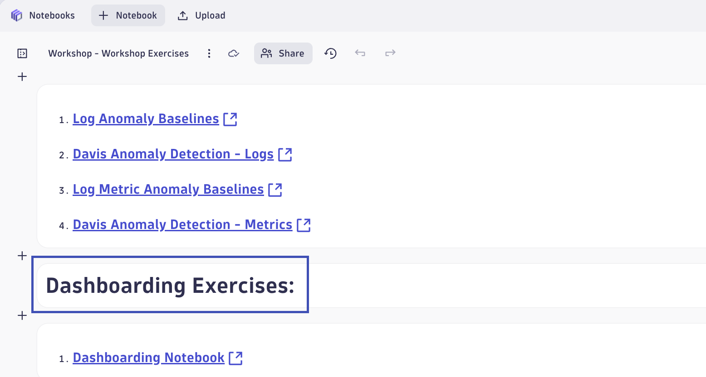
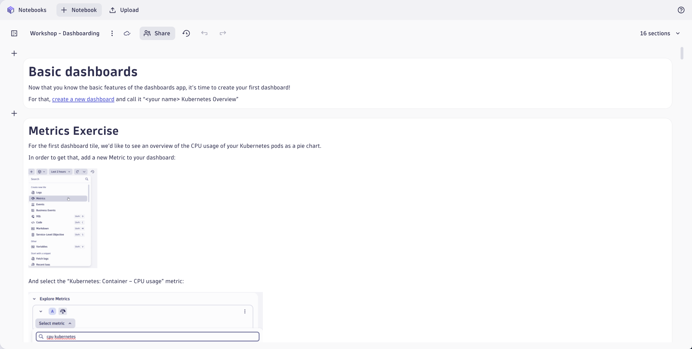

# Dashboards
--8<-- "snippets/send-bizevent/9-dashboards.js"

In this section of the workshop, you'll use Dynatrace log analytics and dashboards to visualize key aspects of your environment, including business outcomes, application resiliency, and infrastructure health — derived from log data in context. By querying and aggregating logs, you can uncover insights into user behavior, transaction success rates, error patterns, and system performance. Dynatrace dashboards allow you to present these insights in a clear, contextualized format, enabling teams to monitor service reliability, detect emerging issues, and correlate technical signals with business impact in real time.

- [Learn More:octicons-arrow-right-24:](https://docs.dynatrace.com/docs/analyze-explore-automate/dashboards-and-notebooks/dashboards-new){target="_blank"}

Return to the Notebook titled `Workshop - Workshop Exercises`.  We will be completing the `Dashboarding Exercises` linked Notebooks.

## Dashboarding

Complete the exercises found in the Notebook `Workshop - Dashboarding`.

Reference the Dashboard `Workshop - My Kubernetes Overview` as needed or upon completion.

## Continue

In the next section, we'll explore additional resources to help you scale log analytics with Dynatrace.

- [Continue to Resources:octicons-arrow-right-24:](resources.md)

