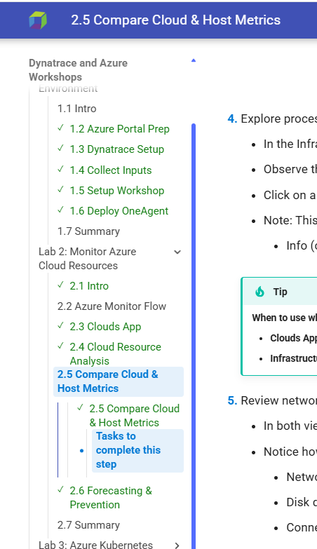

--8<-- "snippets/send-bizevent/index.js"

# **Welcome to Azure Workshops**

This collection of Instructer-led labs and workshops is designed to guide you through common Azure services and development scenarios. Each module provides step-by-step instructions, code snippets, and verification checks.

We recommend starting with **Lab 1** to ensure your environment is set up correctly.

## **Workshop Agenda**

| Lab | Description | Sections | Time |
|-----|-------------|----------|------|
| [Lab 1: Environment Setup](workshops/lab1/index.md) | Connect to pre-provisioned Azure resources, configure Dynatrace tokens | 6 | 20 min |
| [Lab 2: Monitor Azure Cloud](workshops/lab2/index.md) | Explore Clouds App, analyze logs with DQL, compare metrics, forecast capacity | 6 | 30 min |
| [Lab 3: Kubernetes Observability](workshops/lab3/index.md) | Deploy Operator, deploy app, cluster health, resource optimization, troubleshooting, security | 8 | 45 min |
| [Lab 4: Dashboards & Notebooks](workshops/lab4/index.md) | Build custom visualizations with DQL queries | 5 | 30 min |
| [Lab 5: AI Observability](workshops/lab5/index.md) | Monitor LLM-powered applications, analyze prompts and tokens | 7 | 30 min |
| [Lab 6: Cleanup](workshops/lab6/index.md) | Wrapup/Cleanup/Closing | 4 | 10 min |
| | **Total Workshop Duration** | **36** | **~3.25-3.5 hrs** |

## **What You'll Learn**

By completing this workshop, you will:

- **Set up Azure Native Dynatrace Service** - Deploy Dynatrace directly from the Azure Marketplace
- **Monitor Azure Cloud Resources** - Use the Clouds App to explore VMs, AKS, and other Azure services
- **Deploy to Kubernetes** - Deploy a modernized microservices application to AKS
- **Troubleshoot with AI** - Use Dynatrace Intelligence to automatically detect and diagnose issues
- **Build Dashboards** - Create custom visualizations using DQL queries
- **Monitor AI Applications** - Explore AI Observability for LLM-powered services

## **Tracking Your Progress**

As you work through the labs, the workshop automatically tracks your progress. Completed sections are marked with a **checkmark** (✓) and highlighted in **green** on the left navigation bar. This helps you easily see which sections you've finished and where to pick up next.

   

### Resetting Your Progress

If you need to redo a section or start over, you can reset your progress using the buttons at the bottom of each page:

- **Reset Section Progress** — Clears the completion status for the current section only, allowing you to redo that specific part of the lab
- **Reset All Progress** — Clears all completion status across all labs, resetting the entire workshop to the beginning

Look for these buttons at the bottom of any lab section page.

## **Get Started**

[Start Lab 1 →](workshops/lab1/index.md){ .md-button .md-button--primary }