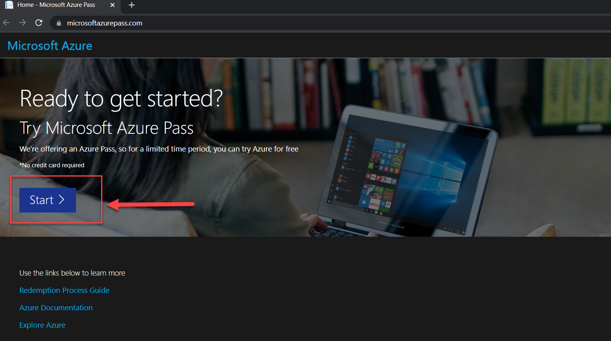

# Lab 1: Setting up Environment

## 1.2 Azure Pass Subscription Setup

To complete this workshop, you will be provided an Azure Pass Promo code.  A workshop staff will provide that code to prior or during the day of the workshop.

That Azure Pass Promo code enables you to have a separate Azure subscription setup under a separate account to provision all the resources needed to complete the workshop.

This free Azure subscription will be available to you for the next 5 days or until when the $100 credit is utilized by the Azure resources (whichever comes first).

### Tasks to complete this step

1. To setup your workshop using free Azure Pass subscription, navigate to <a href="https://www.microsoftazurepass.com/" target="_blank">Microsoft's Azure Pass website</a>
1.  Click on Start.
     
1. Use a ***personal email address*** to signin or create a new Microsoft account email.
     

    !!! tip
        🧮 If you are signed in on a Azure account via your **corporate email**, please signout and login using your personal account or create a new account shown below.

        

1.  Confirm the email address you want to use for your Azure pass subscription and "promo" code provided to allow for the Azure subscription to be setup.
     

    ??? info
        ℹ️ Provisioning your Azure subscription can take upto 5 minutes to process.
