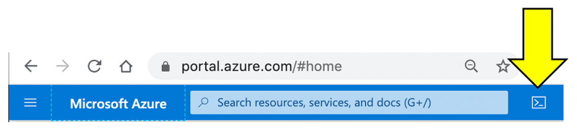

# Lab 1: Setting up Environment

## 1.2 Azure Portal Prep

In this section, you will configure the CloudLabs sandbox environment.

!!! warning "Cloudlabs Access Required"
    All workshop attendees should have received an email from **Cloudlabs** (noreply@cloudlabsai.net) prior to the hands-on workshop with instructions to access the sandbox environment.

    **To access your lab environment:**

    1. Locate the Cloudlabs email in your inbox (check spam/trash if not visible)
    2. Click the **"Access Lab Now"** button in the email
    3. Use the same email address you registered for the workshop

    If you cannot find this email, please notify the workshop facilitator.

### Tasks to complete this step

1. Familiarize yourself with the CloudLabs sandbox environment:

    - **Left side** — A Windows VM desktop where you'll access all resources for this workshop. You'll find shortcuts for Azure Portal, Microsoft Edge, and Visual Studio Code.
    - **Right side** — A panel with several tabs:
        - **Guide** — The hands-on lab instructions (you can follow along here or use the workshop site)
        - **Environment** — Setup details for your sandbox
        - **Resources** — Credentials and passwords for your lab resources
        - **Help** — Support options if you encounter issues
    - **Timer** — Shows remaining time for your lab session (top right)
    - **Zoom** — Click the **A↑ : 100%** icon to adjust the guide text size

    

1.  Click on `Azure Portal` shortcut on the desktop to navigate to <a href="https://portal.azure.com/" target="_blank"> Azure Portal site </a>

    ??? info "Login Credentials"
        When prompted for login credentials, click on the **Environment** tab in your sandbox environment. That tab will have your login credentials for Azure Portal.

        🔥 **Hot Tip:** You can easily paste the username and password to your Windows VM by clicking the **paste icon** under the Action column!

        

1. Once you've successfully logged in to Azure Portal, you'll notice the Azure Native Dynatrace Service (which will give you your own Dynatrace environment) and also Azure resources in the `dynatrace-azure-workshop` Resource group that are pre-provisioned for you.
   


1.  Click on the Cloud Shell button
    

    ??? tip "Bash Shell"
        If you get this prompt, and you need to select which type of shell envrionment to use, choose **Bash**.
        
   
    ??? tip "Storage Account"
        Select the Azure subscription from the dropdown menu. and click `Apply` to create the storage account
        

        On the next screen to `Mount Storage account` select "We will create a storage account for you" and click next.

        **Note:** Creating the storage will take a couple of minutes.

       


    

1.  Once the storage is created, you should see the Unix bash shell.
    

1.  Make a dedicated Azure shell Browser tab by clicking this `New Session` tab icon.
    

1. Within your Azure Cloud Shell window, run this command to download the workshop scripts:
    ```
    git clone https://github.com/dt-alliances-workshops/azure-modernization-dt-orders-setup.git
    ```

1. To validate all the workshop scripts have downloaded, run these commands within the Azure Cloud Shell window to display the directories:
    ```
    cd azure-modernization-dt-orders-setup/
    ls -al
    ```

    ??? example "Expected Output"
        You should see directories similar to the screenshot below:

        

!!! success "Checkpoint"
    Before proceeding to the next section, verify:

    - Azure Cloud Shell is open and working
    - You are using the correct Azure subscription
    - The workshop repository has been cloned successfully
    - You can see the `provision-scripts` and `app-scripts` directories
