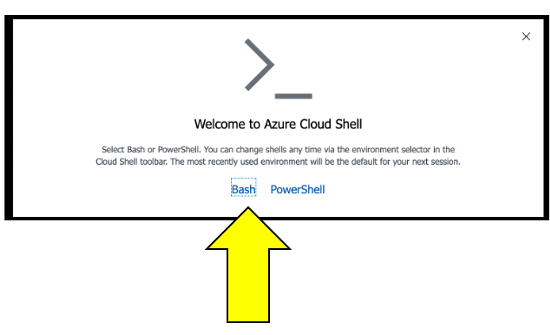

# Lab 1: Setting up Environment

## 1.2 Azure Portal Prep

In this section, you will configure the Azure Cloud Shell and download the workshop scripts. The Cloud Shell provides a browser-based command-line interface for managing Azure resources.

### Tasks to complete this step

1.  Navigate to <a href="https://portal.azure.com/" target="_blank">https://portal.azure.com/ </a>

1.  Click on the Cloud Shell button
    

    !!! tip "Bash Shell"
        🧮If you get this prompt, choose bash.

    

    !!! tip "Azure Pass"
        🧮If you get the prompt below, choose `Azure Pass - Sponsorship` and then click the `Create Storage` button.


    


    ??? info "Storage Account"
        Creating the storage will take a couple of minutes.

1.  Once the storage is created, you should see the Unix bash shell.
    

1.  Make a dedicated Azure shell Browser tab by clicking this new tab icon.
    

1.  To verify which subscription is configured for the Azure CLI, run this command.
     ```console
       az account show
     ```

    1.  Look for the name in the output. This is example when a promo code was used.

        ```
        {
          "environmentName": "AzureCloud",
          "homeTenantId": "xxx-xxx-xxx-xx-xxx",
          "id": "yyy-yyyy-yyy-yyy-yyy",
          "isDefault": true,
          "managedByTenants": [],
          "name": "Azure Pass - Sponsorship",   <----- This is the active subscription
          "state": "Enabled",
          "tenantId": "zzz-zzz-zzz-zzz-zzz",
          "user": {
            "name": "name@company.com",
            "type": "user"
          }
        }
      ```

    !!! tip
        💻 If the subscription is not `Azure Pass - Sponsorship`, run the command below to see all the subscriptions for your user id. If this is the first time using Azure portal or a trial, then you should only have one subscription.

      ```
        az account list --output table
      ```

    1. Here is an sample output:

      ```
        Name                                     CloudName    SubscriptionId                        State    IsDefault
        ---------------------------------------  -----------  ------------------------------------  -------  -----------
        Subscription 1                           AzureCloud   aaaaaaaa-aaaa-aaaa-aaaa-aaaaaaaaaaaa  Enabled  False
        Subscription 2                           AzureCloud   bbbbbbbb-aaaa-aaaa-aaaa-aaaaaaaaaaaa  Enabled  False
        Subscription 3                           AzureCloud   cccccccc-aaaa-aaaa-aaaa-aaaaaaaaaaaa  Enabled  False
        Subscription 4                           AzureCloud   dddddddd-aaaa-aaaa-aaaa-aaaaaaaaaaaa  Enabled  False
        Azure Pass - Sponsorship                 AzureCloud   eeeeeeee-aaaa-aaaa-aaaa-aaaaaaaaaaaa  Enabled  True
      ```

    1.  If the `Azure Pass - Sponsorship` is not the `IsDefault = True`, then run these command to set and verify.

      ```
        # set the subscription
        az account set --subscription <YOUR PROMO SUBSCRIPTION ID>

        # verify change
        az account list --output table

        # double check with
        az account show
      ```

1. Within your Azure Cloud Shell window, run this command to download the workshop scripts:
    ```
      git clone https://github.com/dt-alliances-workshops/azure-modernization-dt-orders-setup.git
    ```
1. To validate all the workshops scripts have download, please run these commands within the Azure Cloud Shell window to display the directories
    ```
      cd azure-modernization-dt-orders-setup/
      ls -al
    ```
    1.  You should see an output similar to the one below
        
