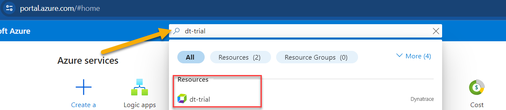

# Lab 1: Setting up Environment

## 1.3 Setup your Dynatrace Environment

In this section, we'll access the new UI for Grail and set up an access token within your Dynatrace environment that will be used by the provisioning script to configure Dynatrace automatically via the API.

### Tasks to complete this step

1.  Access the new UI with Grail
    1.  Open up browser and go to Azure Portal - <a href="https://portal.azure.com/" target="_blank">https://portal.azure.com/ </a>
       - Search for Dynatrace azure resource `dt-trial` from the top search bar
         
       - Click on Go to Dynatrace Link
         

    1. Login to Dynatrace
    1.  On the Left menu, you'll notice a banner to access the new UI that was introduced with Grail.
        - Click on `Take a look` button to access the new UI.
        
        - Click on `Try the latest Dynatrace`
        
         - Click on `Get started`
    1.  You are now accessing the new UI with Grail.
       

1.  Create Dynatrace Access Token and save it for use in the Lab setup.  To capture the token, follow these steps:
    1.  Login into Dynatrace
    1.  From the Left menu, click Apps -> Choose the `Access Tokens` app.
        
    1.  On the Access token page, click the `Generate new token` button
    1.  On the new token page, Enter a name like `azure-workshop`
    1.  Add `Write API Tokens` to the scope.
    1.  Click on Generate token button on the bottom.
    1.  Since this token is only shown once and you will need it in the next labs, copy this value to a local TEXT file before you leave this page. (For example Notepad, Notepad++, Notes.app)
        
    1.  You will use this token in the next step as you setup the lab resources.
