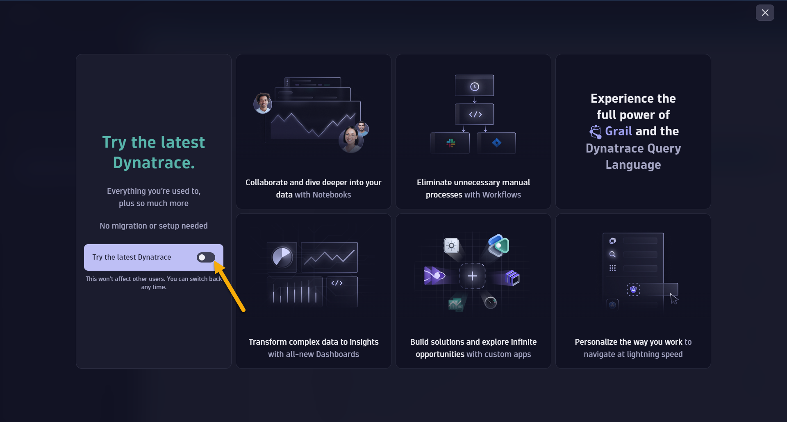

# Lab 1: Setting up Environment

## 1.3 Setup your Dynatrace Environment

In this section, we'll access the new UI for Grail and set up an access token within your Dynatrace environment that will be used by the provisioning script to configure Dynatrace automatically via the API.

### Tasks to complete this step

1. Go back to the Azure Portal tab - <a href="https://portal.azure.com/" target="_blank"> Azure Portal </a>
    - Select the Dynatrace azure resource `dt-trial` from the top bar or under your recent resources list
      
    - Click on **Go to Dynatrace** link
      

1. Login to Dynatrace
    1. When prompted to sign in to Dynatrace, click **Sign in with Microsoft**
       

    1. On the next screen, click **Accept** to grant Dynatrace permission to access your basic profile information (name and email). This enables Single Sign-On (SSO) using the OpenID Connect (OIDC) protocol.
       

    ??? info "How does Sign in with Microsoft work?"
        When you click **Sign in with Microsoft**, Dynatrace initiates an authentication flow using the **OpenID Connect (OIDC)** protocol with Microsoft Entra ID (formerly Azure AD).

        **What happens during this flow:**

        1. Dynatrace requests basic profile information (`openid` and `profile` scopes)
        2. Microsoft prompts you to consent to sharing your name and email with Dynatrace
        3. Once you accept, Microsoft authenticates you and returns an ID token to Dynatrace
        4. Dynatrace creates a session using your `preferred_username` from the token

        **Why is this useful?**

        - **No separate Dynatrace password** — Uses your existing Microsoft credentials
        - **Faster authentication** — If you're already signed into Azure, you may be automatically authenticated
        - **Enterprise-ready** — Works with your organization's Microsoft Entra ID policies

        For more details, see the <a href="https://docs.dynatrace.com/docs/manage/identity-access-management/user-and-group-management/sign-in-with-microsoft" target="_blank">Dynatrace documentation on Sign in with Microsoft</a>.

1. You should be accessing the new UI with Grail.
    

    ??? tip "If you're not seeing the new menu, follow these steps"
        On the left menu, you'll notice a banner to access the new UI that was introduced with Grail.

        - Click on `Take a look` button to access the new UI
          
        - Click on `Try the latest Dynatrace`
          
        - Click on `Get started`

1. Create Dynatrace Access Token and save it for use in the Lab setup. Follow these steps:

    1. From the left menu, click **Apps** → Choose the `Access Tokens` app.
        
    1. On the Access token page, click the `Generate new token` button
    1. On the new token page, enter a name like `azure-workshop`
    1. Add `Write API Tokens` to the scope
    1. Click on **Generate token** button at the bottom
    1. Since this token is only shown once and you will need it in the next labs, copy this value to a local text file before you leave this page (e.g., Notepad, Notepad++, Notes.app)
        
    1. You will use this token in the next step as you setup the lab resources

    ??? info "Save your token in Notepad"
        Open Notepad on your Windows VM and paste the token there. Keep this Notepad session open as you will need this token in the next lab under **Collect Inputs**.

!!! success "Checkpoint"
    Before proceeding to the next section, verify:

    - You can access the Dynatrace environment via Azure Portal
    - You are using the new Dynatrace UI (Grail)
    - You have created an API token with `Write API Tokens` scope
    - You have saved the token value to a local text file
