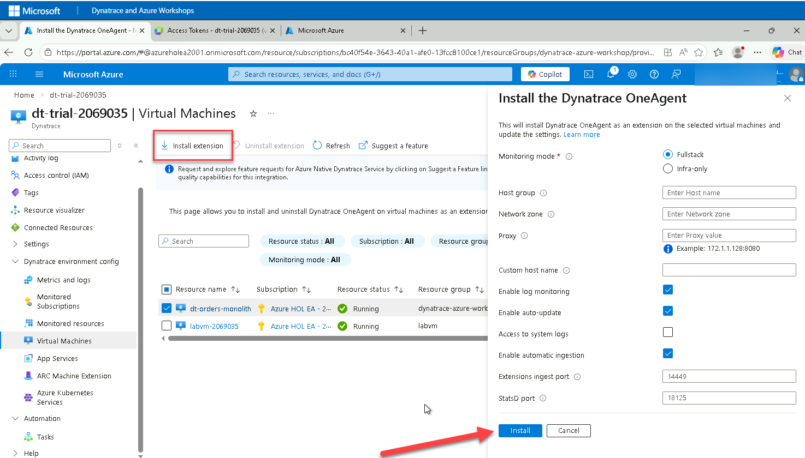

# Lab 1: Setting up Environment

## 1.6 Deploy OneAgent to Azure VM

One key Dynatrace advantage is ease of activation via Azure Portal. OneAgent technology simplifies deployment across large enterprises and relieves engineers of the burden of instrumenting their applications by hand.

With Azure Native Dynatrace Service, you can install OneAgent on Azure Virtual Machines directly from the Dynatrace resource in Azure Portal - no manual SSH or script execution required.

### Tasks to complete this step

#### Step 1: Install OneAgent on the VM

1. Open the **Azure Portal** and search for `Dynatrace` in the top search bar

2. Select your **Azure Native Dynatrace Service** resource (e.g., `dt-trial`)

3. From the left navigation menu, scroll down and click on **Virtual Machines** under the Dynatrace environment config section

4. You will see a list of VMs in your subscription. Find and select the checkbox next to **dt-orders-monolith**

    !!! tip
        The VM should show as "Running" in the Resource Status column and "Not Installed" in the Agent Status column.

5. Click **Install Extension** from the top toolbar

    

6. Wait for the installation to complete. The Agent Status will change to "Installed" once finished.

    !!! warning "Installation Time"
        The extension installation typically takes 2-3 minutes. You can click **Refresh** to check the status.

#### Step 2: Verify OneAgent in Dynatrace

Once the extension is installed, verify that the host appears in Dynatrace.

1. Open your **Dynatrace environment** (click "Go to Dynatrace" from Azure Portal or navigate directly)

2. From the left menu, select `Apps -> Infrastructure & Operations`

3. In the search/filter bar, type `dt-orders-monolith` to find your host

4. Click on the host to view its details. You should see:
    - Host metrics (CPU, Memory, Disk, Network)
    - Running processes
    - Detected services

    !!! info "Data Population Time"
        It may take 2-5 minutes for full metrics and process data to appear after OneAgent installation.

5. Explore the **Processes** section to see the sample application components running on the VM

#### What OneAgent Provides

With OneAgent installed on the VM, you now have access to:

| Capability | Description |
|------------|-------------|
| **Host Metrics** | CPU, memory, disk, and network utilization at 1-minute granularity |
| **Process Monitoring** | Automatic discovery of all running processes and their resource consumption |
| **Service Detection** | Automatic detection of services and their dependencies |
| **Log Ingestion** | Automatic collection of logs from the host |
| **Code-level Insights** | Deep visibility into application performance (Java, .NET, Node.js, etc.) |

!!! success "Checkpoint"
    Before proceeding, verify:

    - The OneAgent extension shows as "Installed" in Azure Portal
    - The `dt-orders-monolith` host appears in Dynatrace Infrastructure & Operations
    - You can see host metrics and running processes in Dynatrace
