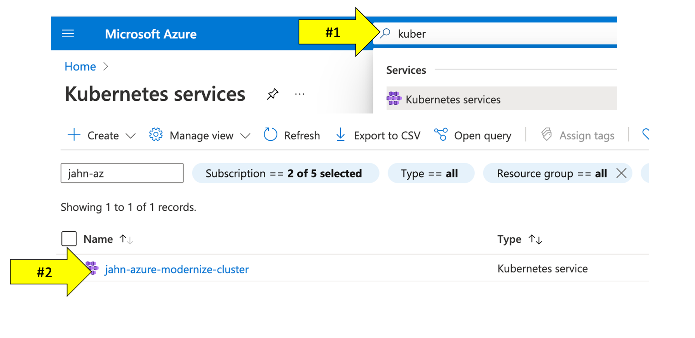

# Lab 1: Setting up Environment

## 1.6 Validate Workshop Setup

In this step we will verify if all of the Azure resources were provisioned for the workshop.

!!! tip
    📓 Only proceed if the provisioning script completed with this status
      ```
        ...
        ...
        =============================================
        Provisioning workshop resources COMPLETE
        =============================================
      ```

### Tasks to complete this step

1. Go back to the window where you have the Azure Portal screen open
2. Search for `Resource Groups` from the search bar at the top

3. Click on `Resource Groups`.  From the list of resource group select `dynatrace-azure-workshop`.
4. Once you're within the resource group, you will see all of the different types of resources we've automatically provisioned for this workshop


5. Verify AKS Cluster is provisioned
    1. In this step we will verify if the Azure Kubernetes Service (AKS) Cluster was provisioned correctly. Also we will download the credentials to manage our AKS cluster via `kubectl` commands.

    1. The <a href="https://kubernetes.io/docs/reference/kubectl/overview/" target="_blank">kubectl</a> command line tool that lets you control Kubernetes clusters.  For details about each command, including all the supported flags and subcommands, see the <a href="https://kubernetes.io/docs/reference/kubectl/overview/" target="_blank">kubectl</a> reference documentation.

    1. Run this command in Azure Cloud shell to get familiar with the command line options for kubectl.

        ```
        kubectl --help
        ```

    1. Configure kubectl to connect to the new cluster by downloading the cluster credentials.

        ```
        az aks get-credentials --resource-group dynatrace-azure-workshop --name dynatrace-azure-workshop-cluster
        ```
    1. Verify you are connected.  You should see `dynatrace-azure-workshop-cluster` as the output.

        ```
        kubectl config current-context
        ```

    1. List the nodes in the cluster

        ```
        kubectl get nodes
        ```

        The output should look like this:

        ```
        NAME                                STATUS   ROLES   AGE   VERSION
        aks-nodepool1-74092643-vmss000000   Ready    agent   21h   v1.19.11
        aks-nodepool1-74092643-vmss000001   Ready    agent   21h   v1.19.11
        ```

        You can see even more detail with this command.

        ```
        kubectl describe nodes
        ```

!!! tip "Kubectl Command Check"
    📓 Ensure you're able to sucessfully run all of the `kubectl` commands above.  This ensures you can sucessfully connectivity to the AKS cluster, which is key in Lab 3 when we deploy the sample application to the AKS cluster.


??? example "Optional Verification of AKS Cluster via Azure Portal"

    - Within the Azure web portal, search for the kubernetes services and then click on the new workshop cluster.
      
    - Explore the configuration to view the number of nodes and the kubernetes version.
       
