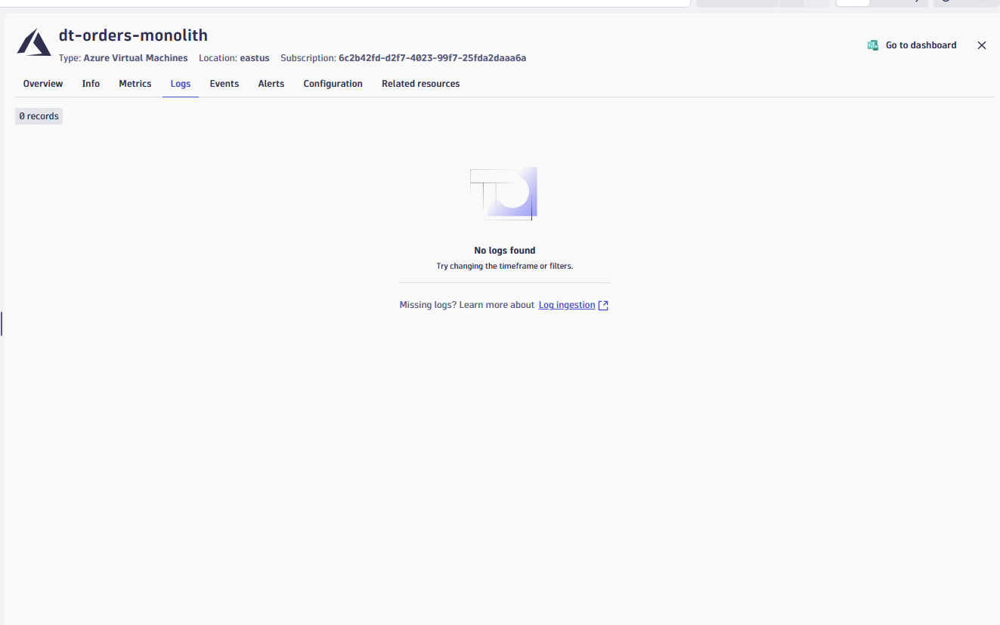

--8<-- "snippets/send-bizevent/2-azure_lab.js"


# Azure Grail Workshop Lab 2 - Azure Cloud Observability

## 2.1 Intro

### The Challenge of Modern Cloud Operations

As organizations increasingly adopt cloud-native architectures on Azure, the complexity of monitoring and managing these environments grows exponentially. Traditional siloed approaches to infrastructure monitoring no longer suffice when you're dealing with distributed microservices, serverless functions, managed databases, and containerized workloads—all generating massive amounts of telemetry data.

**Effective Azure cloud monitoring requires:**

- **Unified observability** across all Azure services—from VMs to AKS to serverless
- **Automatic correlation** of metrics, logs, and traces to reduce mean time to resolution (MTTR)
- **AI-powered anomaly detection** that cuts through the noise and surfaces real issues
- **Context-rich insights** that connect infrastructure health to business impact

### Azure Native Dynatrace Integration

With [Azure Native Dynatrace Service](https://www.dynatrace.com/news/blog/using-dynatrace-on-microsoft-azure/), Dynatrace is available as a first-party Azure resource directly in the Azure Portal. This native integration eliminates the traditional complexity of setting up observability pipelines:

| Traditional Approach | Azure Native Integration |
|---------------------|-------------------------|
| Deploy ActiveGate to query Azure Monitor | ✅ Direct metric ingestion |
| Configure Event Hubs for log forwarding | ✅ Native log streaming |
| Manage Azure Functions for data processing | ✅ Zero infrastructure overhead |
| Manual tagging and resource mapping | ✅ Automatic Azure resource discovery |

This seamless integration enables you to focus on what matters—**understanding your cloud environment and optimizing performance**—rather than managing monitoring infrastructure.  


### Objectives

By the end of this lab, you will be able to:

🔷 **Understand Azure Monitor integration** - Review how Azure Native Dynatrace Service automatically ingests [Azure Monitor](https://azure.microsoft.com/en-us/services/monitor/) metrics without additional infrastructure

🔷 **Navigate the Clouds App** - Use the Dynatrace Clouds app to explore Azure resources, view metrics, logs, and filter services across your cloud environment

🔷 **Analyze logs in context** - Access and filter logs directly from cloud resources, correlating them with metrics for effective troubleshooting

🔷 **Query logs with DQL** - Use Dynatrace Query Language to search and analyze log data across your Azure environment

🔷 **Compare observability perspectives** - Understand the difference between Azure Monitor metrics (Clouds App) and OneAgent metrics (Infrastructure & Operations) to choose the right data for each use case

## 2.2 How Azure Monitor Data Flows to Dynatrace

The diagram below illustrates how Dynatrace ingests Azure Monitor metrics through the native integration.


**Data Flow:**

1. **Azure Resources** — Your VMs, AKS clusters, databases, and other services generate metrics and logs
2. **Azure Monitor** — Automatically collects metrics from all Azure resources; you can enable Diagnostic Settings for additional telemetry
3. **Azure Native Dynatrace Service** — A <a href="https://docs.dynatrace.com/docs/setup-and-configuration/setup-on-cloud-platforms/microsoft-azure-services/azure-platform/azure-native-integration" target="_blank">first-party Azure resource</a> that pulls metrics and streams logs directly from Azure Monitor
4. **Dynatrace** — Receives, stores, and correlates all telemetry, enabling you to query, visualize, and alert on your Azure environment

This integration provides:

- **Automated onboarding** — No manual configuration of data pipelines
- **Instant insights** — Pre-built anomaly detectors and visualizations for Azure services
- **Resource topology** — Automatic discovery of Azure resource relationships
- **Tags and metadata** — Azure tags flow into Dynatrace for filtering and access control
- **Unified telemetry** — Metrics, logs, and configuration data in a single platform


## 2.3 Explore the Clouds App

The <a href="https://www.dynatrace.com/hub/detail/clouds/?query=clouds&filter=all" target="_blank">Dynatrace Clouds App</a> provides a centralized view of all your cloud resources across multiple providers. Instead of switching between Azure Portal, AWS Console, and GCP Console, you can monitor everything from a single interface.

**Key capabilities:**

- **Unified visibility** — View resources across Azure, AWS, and GCP in one place
- **Logs and metrics in context** — Access telemetry directly from any resource with a single click
- **Enhanced troubleshooting** — See patterns and anomalies across all cloud environments rather than analyzing them in isolation

For more details, see the <a href="https://docs.dynatrace.com/docs/platform-modules/infrastructure-monitoring/cloud-platform-monitoring/clouds-app" target="_blank">Clouds App documentation</a> and this <a href="https://www.dynatrace.com/news/blog/maximizing-the-potential-of-multicloud-strategy-with-the-dynatrace-cloud-app/" target="_blank">blog post on multicloud use cases</a>.

### Tasks to complete this step

1. Open the Clouds App
    - In Dynatrace, from the menu on the left, select `Apps -> Clouds`
    - You'll see a list of all discovered cloud services

1. Explore an Azure VM
    - Click on `All Services` and select the Azure VM called `dt-orders-monolith`
    
    - Review the **Info** tab for resource properties and other metadata we collect.
    - Click on the **Metrics** tab to see Azure Monitor metrics for this VM    
    - Check the **Problems** & **Events** tab to see if there are any open issues or events tied to this resource.
    - Check the **Configuration** tab look at all of the configuration data that Dynatrace collects for this resource.


1. Use filters to find resources
    - Experiment with the filtering options at the top of the Clouds App
    - Try filtering by:
        - **Service type** (e.g., Virtual Machines, Load Balancers, Storage Accounts)
        - **Region** (e.g., East US, West Europe)
        - **Tags** (e.g., Owner:azure-modernize-workshop)
    

1. Review resource relationships
    - Select any resource and click on the **Related Resources** tab
    - Notice how Dynatrace maps the connections between Azure resources (e.g., VM → Network Interface → NSG)

## 2.4 Log Analysis via Clouds App

Understanding logs in the context of your cloud resources is essential for effective troubleshooting. The Dynatrace Clouds App provides seamless access to logs directly from any cloud resource, eliminating the need to switch between tools or manually correlate data.

With Azure Native Dynatrace Service, logs from your Azure resources are automatically streamed to Dynatrace, where they're indexed and available for analysis alongside metrics and topology data.

### Tasks to complete this step

1. Navigate to the Clouds App
    - In Dynatrace, from the menu on the left, select `Apps -> Clouds`
    - Click on `All Services` and locate the `dt-orders-monolith` Azure VM

2. Access logs for the VM
    - Click on the VM to open its detail view
    - Select the `Logs` tab to view all logs associated with this resource
    

3. Query logs and metrics in a Notebook
    - From the left menu, select `Apps -> Notebooks`
    - Create a new notebook by clicking `+ Notebook`
    - Add three sections with the following queries:

    === "Section 1: Log Sources"

        Add a new section and run this DQL query to see what log sources are being ingested:

        ```dql title="Explore Log Sources"
        fetch logs
        | summarize log_count = count(), by: {log.source}
        | sort log_count desc
        ```

        This shows all log sources and their volume — useful for understanding what telemetry is flowing into Dynatrace.

    === "Section 2: Log Volume"

        Add another section and run this query to visualize log ingestion patterns:

        ```dql title="Log Volume Over Time"
        fetch logs
        | makeTimeseries log_count = count(), interval: 5m
        ```

        This creates a time series chart showing log volume over time.

    === "Section 3: CPU Metrics"

        Add a third section to compare with host CPU metrics:

        ```dql title="CPU Metrics Over Time"
        timeseries cpu = avg(dt.host.cpu.usage), by: {dt.entity.host}
        | fieldsAdd host_name = entityName(dt.entity.host)
        | filter contains(host_name, "monolith")
        ```

        Compare this chart with the log volume chart to identify correlations.

    !!! tip
        **SRE Best Practice:** By viewing logs and metrics side-by-side in a notebook, you can visually correlate patterns. For example, a spike in log volume might coincide with increased CPU usage during a deployment or incident.

    ??? info
        ℹ️ DQL (Dynatrace Query Language) is the native query language for Grail. It allows you to query logs, metrics, and events using a unified syntax. Learn more in the <a href="https://docs.dynatrace.com/docs/platform/grail/dynatrace-query-language" target="_blank">DQL Documentation</a>.

4. **Optional: Cloud Governance Queries for SRE/CloudOps**

    These additional DQL queries demonstrate how Dynatrace can support governance and cost optimization use cases.

    === "Resource Inventory"

        List all Azure VMs with their tags and resource groups:

        ```dql title="List all Azure VMs"
        fetch dt.entity.azure_vm
        | fields entity.name, tags, azureResourceGroupName
        | sort entity.name
        ```

        Use this to get a complete inventory of Azure VMs and their associated tags and resource groups.

    === "Tag Compliance"

        Find resources missing required tags:

        ```dql title="Find VMs missing Owner tag"
        fetch dt.entity.azure_vm
        | fields entity.name, tags
        | filter NOT contains(toString(tags), "Owner")
        ```

        This query identifies VMs that are missing the "Owner" tag — useful for enforcing tagging policies and governance.

    === "Cost Optimization"

        Find hosts with low CPU utilization:

        ```dql title="Find underutilized hosts"
        timeseries cpu = avg(dt.host.cpu.usage), by: {dt.entity.host}
        | filter cpu < 10
        | fieldsAdd host_name = entityName(dt.entity.host)
        ```

        Identifies potentially underutilized hosts that could be candidates for rightsizing or decommissioning.

    !!! tip
        **CloudOps Best Practice:** Run these governance queries regularly or build dashboards to track compliance and resource utilization over time. This helps identify cost savings opportunities and ensures adherence to organizational policies.


## 2.5 Compare Cloud Metrics vs OneAgent Metrics

Dynatrace provides two complementary perspectives for monitoring your Azure infrastructure:

| Data Source | Collected Via | Best For |
|-------------|---------------|----------|
| **Azure Monitor Metrics** | Azure Native Integration | Cloud service health, billing metrics, managed services |
| **OneAgent Metrics** | Dynatrace OneAgent | Deep process visibility, code-level insights, real-time alerting |

Understanding when to use each view helps SREs and CloudOps teams choose the right data for their use case.

### Tasks to complete this step

1. View Azure VM in Clouds App (Azure Monitor data)
    - In Dynatrace, navigate to `Apps -> Clouds`
    - Select `Virtual Machines` from the service type filter
    - Click on the `dt-orders-monolith` VM
    - Review the metrics displayed (CPU, Network, Disk)
    

    ??? info
        ℹ️ These metrics come from **Azure Monitor** via the Azure Native Dynatrace Service integration. They represent what Azure observes at the hypervisor/platform level.

2. View the same VM in Infrastructure & Operations App (OneAgent data)
    - From the left menu, select `Apps -> Infrastructure & Operations`
    - In the search/filter, find the same `dt-orders-monolith` host
    - Click on the host to open its detail view
    

3. Compare CPU and Memory metrics between the two views
    - In the Clouds App, note the CPU percentage for the VM
    - In Infrastructure & Operations, review the CPU metrics
    - Compare the following:

    | Aspect | Clouds App | Infrastructure & Operations |
    |--------|------------|----------------------------|    
    | CPU breakdown | Total utilization | User, system, I/O wait, steal |
    | Process visibility | Not available | Per-process CPU usage |
    | Historical data | Based on Azure retention | Based on Dynatrace retention |

    

4. Explore process-level visibility (OneAgent advantage)
    - In the Infrastructure & Operations host view, scroll to the `Processes` section
    - Observe the individual processes running on the VM
    - Click on a process (e.g., `monolith-backend`) to see its resource consumption
    - Note: This level of detail is **only available via OneAgent**
        - Info (configuration), Metrics, Java metrics

    !!! tip
        **When to use which view:**

        - **Clouds App (Azure Monitor):** Quick health checks, managed services without OneAgent
        - **Infrastructure & Operations (OneAgent):** Root cause analysis, process-level troubleshooting, real-time alerting, code-level diagnostics

5. Review network and disk metrics in host overview tab    
    - In both views, examine network throughput and disk I/O metrics
    - Notice how OneAgent provides additional context like:
        - Network traffic by process
        - Disk queue length and latency
        - Connection details to other hosts/services

6. Understand the Smartscape topology
    - From the Infrastructure & Operations host view, click on `...` in upper right hand corner and select `Open with..`, then select `View Topology (new)` or view the topology
    
    - Notice how Dynatrace connects the Azure VM to:
        - Running processes
        - Services (detected by OneAgent)
        - Dependent services like containers
    - This unified view combines Azure Monitor data with OneAgent telemetry
    

    ??? info
        ℹ️ **Unified Observability:** Dynatrace automatically correlates data from Azure Monitor and OneAgent, providing a complete picture. You don't have to choose one or the other—both data sources enrich the same entity in Dynatrace.


## Summary

In this section, you should have completed the following:

✅ Reviewed how Dynatrace integrates with Azure Monitor

✅ Explored the Clouds App for multi-cloud resource visibility

✅ Analyzed logs directly from cloud resources in context

✅ Used DQL in Notebooks to query logs and metrics side-by-side

✅ (Optional) Explored governance queries for resource inventory, tag compliance, and cost optimization

✅ Compared Azure Monitor metrics with OneAgent metrics to understand when to use each

✅ Learned how Dynatrace provides unified observability across data sources 

## Next Lab...

In Lab3, we'll setup Dynatrace on Azure Kubernetes Service.
<div class="grid cards" markdown>
- [Continue to Lab3:octicons-arrow-right-24:](/azure-workshops/workshops/lab3/03_AKS)
</div>