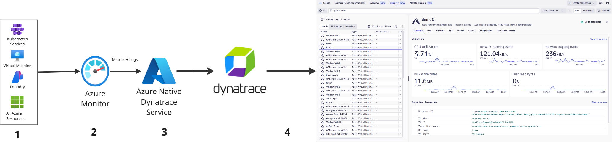

# Lab 2: Monitor Azure Cloud Resources

## 2.2 How Azure Monitor Data Flows to Dynatrace

The diagram below illustrates how Dynatrace ingests Azure Monitor metrics through the native integration.

**Data Flow:**

1. **Azure Resources** — Your VMs, AKS clusters, databases, and other services generate metrics and logs
2. **Azure Monitor** — Automatically collects metrics from all Azure resources; you can enable Diagnostic Settings for additional telemetry
3. **Azure Native Dynatrace Service** — A <a href="https://docs.dynatrace.com/docs/setup-and-configuration/setup-on-cloud-platforms/microsoft-azure-services/azure-platform/azure-native-integration" target="_blank">first-party Azure resource</a> that pulls metrics and streams logs directly from Azure Monitor
4. **Dynatrace** — Receives, stores, and correlates all telemetry, enabling you to query, visualize, and alert on your Azure environment

This integration provides:

- **Automated onboarding** — No manual configuration of data pipelines
- **Instant insights** — Pre-built anomaly detectors and visualizations for Azure services
- **Resource topology** — Automatic discovery of Azure resource relationships
- **Tags and metadata** — Azure tags flow into Dynatrace for filtering and access control
- **Unified telemetry** — Metrics, logs, and configuration data in a single platform

!!! success "Checkpoint"
    Before proceeding to the next section, verify you understand:

    - How Azure Monitor data flows to Dynatrace via Azure Native Dynatrace Service
    - The benefits of the native integration vs traditional approaches
