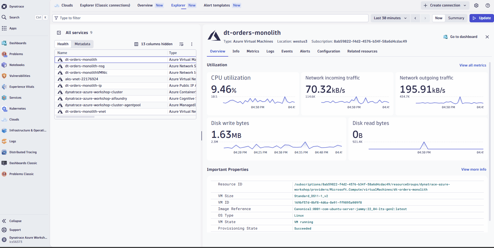
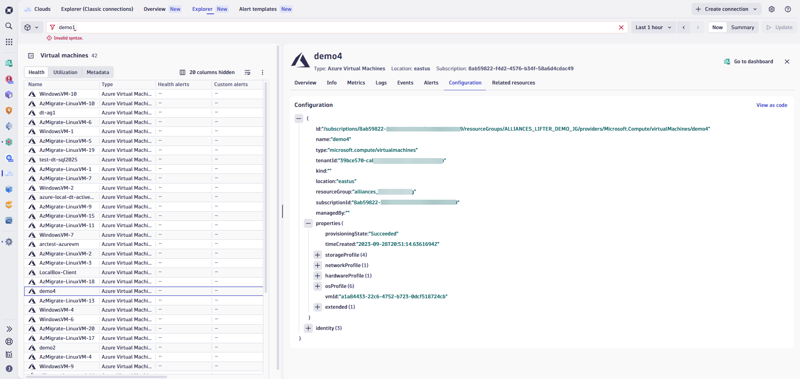
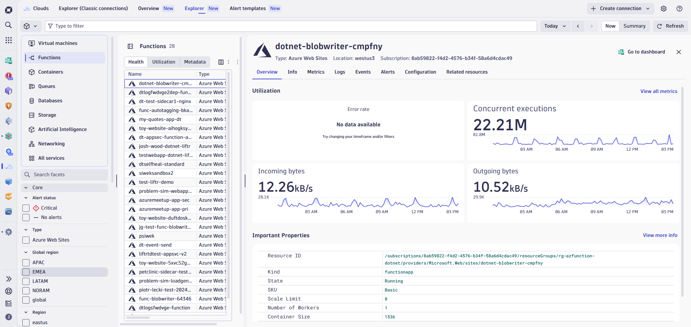

# Lab 2: Monitor Azure Cloud Resources

## 2.3 Explore the Clouds App

!!! warning "Shared Workshop Environment"
    **For this section only (2.3), you will use a shared Dynatrace environment** instead of your own. This is because the Clouds App is currently in **private preview** and requires special access.

    **Shared Environment URL:** [TODO: INSERT DYNATRACE ENVIRONMENT LINK]

    Please log in to the shared environment now before continuing with the tasks below.

!!! info "Why a Different Environment?"
    The Clouds App provides a unified view of cloud resources across Azure, AWS, and GCP. Since this feature is in private preview, we've set up a shared environment pre-configured with:

    - Access to the Clouds App (private preview)
    - Sample Azure resources for you to explore
    - Pre-ingested metrics and logs from Azure Monitor

    You will return to your own Dynatrace environment in section 2.4.

The <a href="https://www.dynatrace.com/hub/detail/clouds/?query=clouds&filter=all" target="_blank">Dynatrace Clouds App</a> provides a centralized view of all your cloud resources across multiple providers. Instead of switching between Azure Portal, AWS Console, and GCP Console, you can monitor everything from a single interface.

**Key capabilities:**

- **Easy, automated onboarding** — All observability telemetry with GitOps by design
- **Ready-made observability** — Instant insights with built-in anomaly detectors and visualizations
- **Deep insights** — Resource configurations, health events, and cloud topology
- **Leverage cloud tags** — Instant visibility and access control using your existing tagging strategy
- **All telemetry in context** — Metrics, Logs, Traces, Topology, Configurations, and Health Events in one place

For more details, see the <a href="https://docs.dynatrace.com/docs/platform-modules/infrastructure-monitoring/cloud-platform-monitoring/clouds-app" target="_blank">Clouds App documentation</a> and this <a href="https://www.dynatrace.com/news/blog/maximizing-the-potential-of-multicloud-strategy-with-the-dynatrace-cloud-app/" target="_blank">blog post on multicloud use cases</a>.

### Tasks to complete this step

1. Open the Clouds App
    - In Dynatrace, from the menu on the left, select `Apps -> Clouds`
    - You'll see a list of all discovered cloud services

1. Explore an Azure VM
    - Click on `All Services` and select the Azure VM called `dt-orders-monolith`
    
    - Review the **Info** tab for resource properties and other metadata we collect
    - Click on the **Metrics** tab to see Azure Monitor metrics for this VM
    - Check the **Problems** & **Events** tab to see if there are any open issues or events tied to this resource

1. Use filters to find resources
    - Experiment with the filtering options at the top of the Clouds App
    - Try filtering by:
        - **Service type** (e.g., Virtual Machines, Load Balancers, Storage Accounts)
        - **Region** (e.g., East US, West Europe)
        - **Tags** (e.g., Owner:azure-modernize-workshop)
    

1. Review resource relationships
    - Select any resource and click on the **Related Resources** tab
    - Notice how Dynatrace maps the connections between Azure resources (e.g., VM → Network Interface → NSG)

1. Explore resource configuration details
    - With the `dt-orders-monolith` VM still selected, click the **Configuration** tab
    - Review properties like:
        - VM size and instance type
        - Network security group rules
        - Disk configurations
        - Tags and metadata

        

    !!! info "Configuration Use Cases"
        The configuration data enables use cases like:

        - **Security** — Which compute resources are internet-accessible?
        - **Compliance** — Are roles shared across resources appropriately?
        - **Cost Optimization** — Identify overprovisioned resources

1. Navigate to Smartscape view (**REMOVE - Might not be available in time**)
    - From the resource details panel, click **Go to Smartscape** (or look for the topology icon)
    - Smartscape is a dynamic, real-time map of your tech environment that automatically discovers infrastructure, services, processes, and applications
    - Explore the relationships between your Azure resources

    !!! tip "Smartscape for Clouds"
        Smartscape enables you to:

        - **Understand relationships** among resources
        - **Access fine-grained cloud resource configuration**
        - **Leverage DQL** to combine entity and signal data
        - Use attributes you're used to from Azure, AWS, or GCP

1. Find resources with problems (**REMOVE - Might not be available in time**)
    - In the Clouds App, look at the **Alert status** filter in the left sidebar
    - Filter for resources with **Critical** or **Warning** alerts
    - Click on a resource with an alert to investigate the issue
    - Explore the **Events** tab to see the problem history

    

!!! success "Checkpoint"
    Before proceeding to the next section, verify:

    - You can access the Clouds App and see Azure resources
    - You found the `dt-orders-monolith` VM and reviewed its metrics
    - You experimented with filters to find resources by type, region, or tags
    - You explored the Configuration tab for a resource
    - You understand how to navigate to Smartscape for topology visualization
