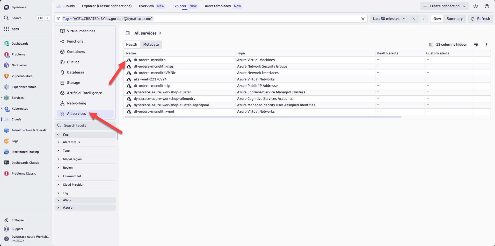

# Lab 2: Monitor Azure Cloud Resources

## 2.3 Explore the Clouds App

The <a href="https://www.dynatrace.com/hub/detail/clouds/?query=clouds&filter=all" target="_blank">Dynatrace Clouds App</a> provides a centralized view of all your cloud resources across multiple providers. Instead of switching between Azure Portal, AWS Console, and GCP Console, you can monitor everything from a single interface.

**Key capabilities:**

- **Unified visibility** — View resources across Azure, AWS, and GCP in one place
- **Logs and metrics in context** — Access telemetry directly from any resource with a single click
- **Enhanced troubleshooting** — See patterns and anomalies across all cloud environments rather than analyzing them in isolation

For more details, see the <a href="https://docs.dynatrace.com/docs/platform-modules/infrastructure-monitoring/cloud-platform-monitoring/clouds-app" target="_blank">Clouds App documentation</a> and this <a href="https://www.dynatrace.com/news/blog/maximizing-the-potential-of-multicloud-strategy-with-the-dynatrace-cloud-app/" target="_blank">blog post on multicloud use cases</a>.

### Tasks to complete this step

1. Open the Clouds App
    - In Dynatrace, from the menu on the left, select `Apps -> Clouds`
    - You'll see a list of all discovered cloud services

1. Explore an Azure VM
    - Click on `All Services` and select the Azure VM called `dt-orders-monolith`
    
    - Review the **Info** tab for resource properties and other metadata we collect.
    - Click on the **Metrics** tab to see Azure Monitor metrics for this VM
    - Check the **Problems** & **Events** tab to see if there are any open issues or events tied to this resource.
    - Check the **Configuration** tab look at all of the configuration data that Dynatrace collects for this resource.

1. Use filters to find resources
    - Experiment with the filtering options at the top of the Clouds App
    - Try filtering by:
        - **Service type** (e.g., Virtual Machines, Load Balancers, Storage Accounts)
        - **Region** (e.g., East US, West Europe)
        - **Tags** (e.g., Owner:azure-modernize-workshop)
    

1. Review resource relationships
    - Select any resource and click on the **Related Resources** tab
    - Notice how Dynatrace maps the connections between Azure resources (e.g., VM → Network Interface → NSG)
