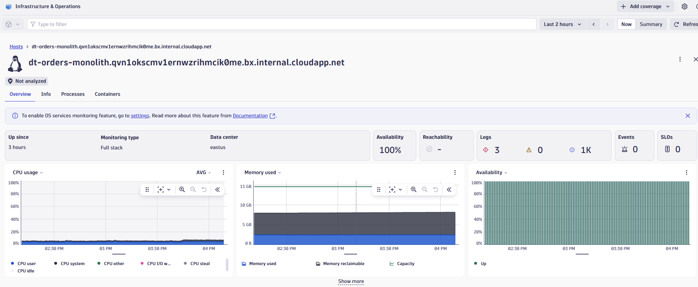
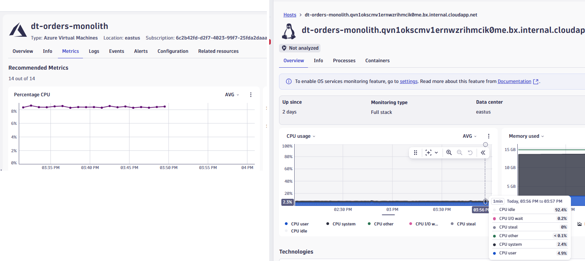
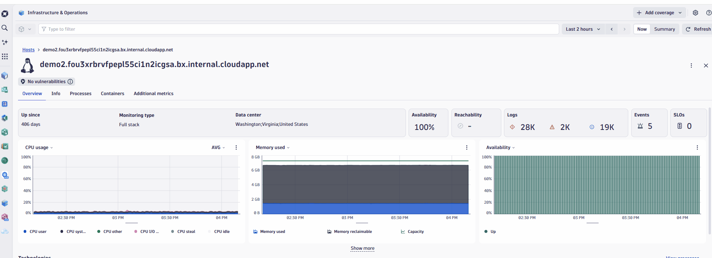
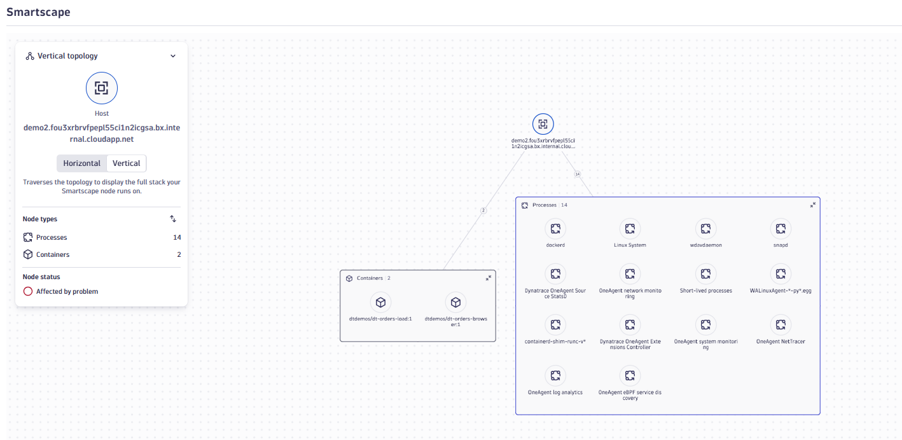

# Lab 2: Monitor Azure Cloud Resources

## 2.5 Compare Cloud & Host Metrics

!!! info "Continue Using Your Own Environment"
    You should be logged into **your own Dynatrace environment** that you returned to in section 2.4.

Dynatrace provides two complementary perspectives for monitoring your Azure infrastructure:

| Data Source | Collected Via | Best For |
|-------------|---------------|----------|
| **Azure Monitor Metrics** | Azure Native Integration | Cloud service health, billing metrics, managed services |
| **OneAgent Metrics** | Dynatrace OneAgent | Deep process visibility, code-level insights, real-time alerting |

Understanding when to use each view helps SREs and CloudOps teams choose the right data for their use case.

### Tasks to complete this step

1. View Azure VM in Clouds App (Azure Monitor data)
    - In Dynatrace, navigate to `Apps -> Clouds`
    - Select `Virtual Machines` from the service type filter
    - Click on the `dt-orders-monolith` VM
    - Review the metrics displayed (CPU, Network, Disk)
    

    ??? info
        ℹ️ These metrics come from **Azure Monitor** via the Azure Native Dynatrace Service integration. They represent what Azure observes at the hypervisor/platform level.

2. View the same VM in Infrastructure & Operations App (OneAgent data)
    - From the left menu, select `Apps -> Infrastructure & Operations`
    - In the search/filter, find the same `dt-orders-monolith` host
    - Click on the host to open its detail view
    

3. Compare CPU and Memory metrics between the two views
    - In the Clouds App, note the CPU percentage for the VM
    - In Infrastructure & Operations, review the CPU metrics
    - Compare the following:

    | Aspect | Clouds App | Infrastructure & Operations |
    |--------|------------|----------------------------|
    | CPU breakdown | Total utilization | User, system, I/O wait, steal |
    | Process visibility | Not available | Per-process CPU usage |
    | Historical data | Based on Azure retention | Based on Dynatrace retention |

    

4. Explore process-level visibility (OneAgent advantage)
    - In the Infrastructure & Operations host view, scroll to the `Processes` section
    - Observe the individual processes running on the VM
    - Click on a process (e.g., `monolith-backend`) to see its resource consumption
    - Note: This level of detail is **only available via OneAgent**
        - Info (configuration), Metrics, Java metrics

    !!! tip
        **When to use which view:**

        - **Clouds App (Azure Monitor):** Quick health checks, managed services without OneAgent
        - **Infrastructure & Operations (OneAgent):** Root cause analysis, process-level troubleshooting, real-time alerting, code-level diagnostics

5. Review network and disk metrics in host overview tab
    - In both views, examine network throughput and disk I/O metrics
    - Notice how OneAgent provides additional context like:
        - Network traffic by process
        - Disk queue length and latency
        - Connection details to other hosts/services

6. Understand the Smartscape topology
    - From the Infrastructure & Operations host view, click on `...` in upper right hand corner and select `Open with..`, then select `View Topology (new)` or view the topology
    
    - Notice how Dynatrace connects the Azure VM to:
        - Running processes
        - Services (detected by OneAgent)
        - Dependent services like containers
    - This unified view combines Azure Monitor data with OneAgent telemetry
    

    ??? info
        ℹ️ **Unified Observability:** Dynatrace automatically correlates data from Azure Monitor and OneAgent, providing a complete picture. You don't have to choose one or the other—both data sources enrich the same entity in Dynatrace.

!!! success "Checkpoint"
    Before proceeding to the next section, verify:

    - You viewed the same VM in both Clouds App and Infrastructure & Operations
    - You understand the difference between Azure Monitor metrics and OneAgent metrics
    - You explored process-level visibility available only via OneAgent
    - You viewed the Smartscape topology for the host
