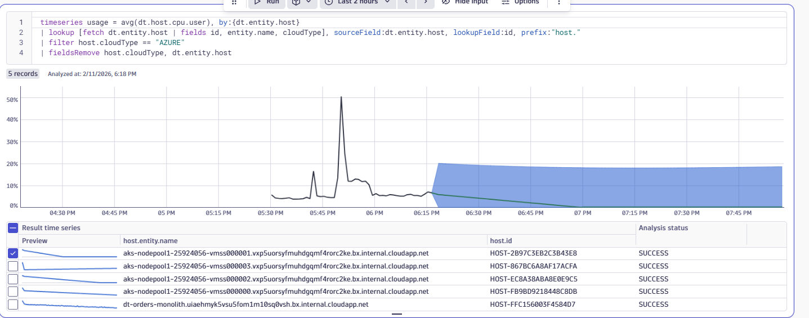

# Lab 2: Monitor Azure Cloud Resources

## 2.5 Forecasting & Auto-Prevention

!!! info "Continue Using Your Own Environment"
    You should still be logged into **your own Dynatrace environment**. The Forecasting features covered in this section work with your Azure VMs monitored by OneAgent.

### Overview

One of the key pillars of Modern Cloud Operations is **Prevention** — automating DevOps and SRE tasks with preventive automation and reacting to health changes before they impact your users.

Dynatrace Intelligence enables you to forecast utilization of cloud resources and foresee potential issues like CPU spikes or resource exhaustion before they impact your users.

### Tasks to complete this step

#### Forecast VM CPU Usage in a Notebook

1. Open the Notebooks app
    - In Dynatrace, from the menu on the left, select `Apps -> Notebooks`
    - Create a new notebook or open an existing one

1. Add a DQL section to query CPU metrics
    - Click **+ Add section** and select **DQL**
    - Copy and paste the following query to analyze CPU usage:

    ```dql title="Forecast CPU usage for Azure VMs"
    timeseries usage = avg(dt.host.cpu.user), by:{dt.entity.host}
    | lookup [fetch dt.entity.host | fields id, entity.name, cloudType], sourceField:dt.entity.host, lookupField:id, prefix:"host."
    | filter host.cloudType == "AZURE"
    | fieldsRemove host.cloudType, dt.entity.host
    ```

    - Click **Run** to see the current CPU utilization for your Azure VMs

1. Add Dynatrace Intelligence forecasting via visualization
    - After running your query, click on **Options** and the **Visualizations** section
    - Select **Line chart** as the visualization type (if not already selected)
    - In the visualization settings, scroll down to **Analyze and Alert** section
    - Enable **AI data analysis** and select:
        - Forecast
        - Accept the defaults that are in there for data points to predict and forecast offset
    - The chart will now display predicted values as a dashed line extending beyond your current data

    

    
    !!! tip "Dynatrace Intelligence Forecasting"
        Dynatrace Intelligence forecasting uses machine learning to predict future values based on historical patterns. The forecast appears as a shaded band on your time series chart, helping you visualize potential issues before they occur. Note that forecasting works best with metrics that have variance and patterns - CPU usage typically shows clear patterns that Dynatrace Intelligence can use for predictions.

### Key Takeaways

| Concept | Description |
|---------|-------------|
| **Dynatrace Intelligence Forecasting** | Predicts future resource utilization based on historical patterns |
| **Proactive Monitoring** | Forecasting helps identify potential issues before they impact users |
| **Prevention over Reaction** | Modern Cloud Operations focuses on preventing issues, not just detecting them |

!!! success "Checkpoint"
    Before proceeding to the next section, verify:

    - You created a DQL query to analyze CPU utilization
    - You added Dynatrace Intelligence forecasting to predict future values
    - You can identify VMs where CPU usage may spike or require attention
