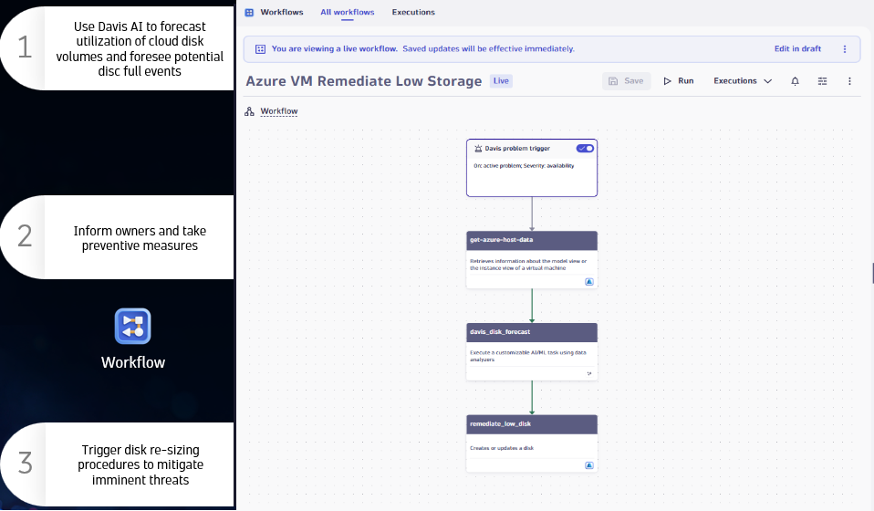

# Lab 2: Monitor Azure Cloud Resources

## 2.6 Forecasting & Auto-Prevention

!!! info "Continue Using Your Own Environment"
    You should still be logged into **your own Dynatrace environment**. The Forecasting and Workflows features covered in this section work with your Azure VMs monitored by OneAgent.

### Overview

One of the key pillars of Modern Cloud Operations is **Prevention** — automating DevOps and SRE tasks with preventive automation and reacting to health changes before they impact your users.

Davis AI enables you to forecast utilization of cloud resources and foresee potential issues like disk full events. By combining forecasting with Dynatrace Workflows, you can:

1. **Predict** — Use Davis AI to forecast resource utilization
2. **Inform** — Notify owners and stakeholders of upcoming issues
3. **Prevent** — Trigger automated remediation before problems occur



### Tasks to complete this step

#### Part 1: Forecast VM Disk Storage in a Notebook

1. Open the Notebooks app
    - In Dynatrace, from the menu on the left, select `Apps -> Notebooks`
    - Create a new notebook or open an existing one

1. Add a DQL section to query disk metrics
    - Click **+ Add section** and select **DQL**
    - Copy and paste the following query to analyze disk free space:

    ```dql title="Forecast disk free space for Azure VMs"
    timeseries avg(dt.host.disk.free), by:{dt.entity.host}
    | lookup [fetch dt.entity.host | fields id, entity.name, cloudType], sourceField:dt.entity.host, lookupField:id, prefix:"host."
    | filter host.cloudType == "AZURE"
    ```

    - Click **Run** to see the current disk utilization for your Azure VMs

1. Add Davis AI forecasting
    - Modify the query to include Davis AI prediction:

    ```dql title="Forecast disk usage with Davis AI"
    timeseries usage = avg(dt.host.disk.free), by:{dt.entity.host}
    | lookup [fetch dt.entity.host | fields id, entity.name, cloudType], sourceField:dt.entity.host, lookupField:id, prefix:"host."
    | filter host.cloudType == "AZURE"
    | davisForecast duration:14d, historyPattern:7d
    ```

    - The forecast shows predicted values for the next 14 days based on 7 days of historical patterns
    - Look for any VMs where disk free space is predicted to drop below a critical threshold

    

    !!! tip "Davis AI Forecasting"
        The `davisForecast` function uses machine learning to predict future values based on historical patterns. You can adjust:

        - `duration` — How far into the future to predict
        - `historyPattern` — How much historical data to use for pattern recognition

#### Part 2: Explore Forecasting in Workflows

Dynatrace Workflows can trigger automated remediation based on Davis AI problems, including forecasted resource exhaustion.

1. Navigate to Workflows
    - From the menu, select `Automate -> Workflows`
    - You can explore existing workflows or create new ones

1. Understand the workflow pattern for auto-prevention
    - A typical prevention workflow includes:
        - **Trigger**: Davis problem (e.g., "Disk will be full in 3 days")
        - **Get resource data**: Query for affected hosts/volumes
        - **Run forecast**: Confirm the prediction with Davis AI
        - **Take action**: Resize disk, notify owner, or create ticket

    ```yaml title="Example workflow structure"
    Trigger: Davis problem trigger
        ↓
    Get host data: Query affected resources
        ↓
    Run forecast: Confirm disk will fill
        ↓
    Remediate: Call Azure API to resize disk
    ```

1. Review Davis problems for forecasts
    - Navigate to `Observe -> Problems`
    - Look for any problems with titles like "Disk will be full" or "Resource shortage predicted"
    - These predictive problems are created by Davis AI before the actual issue occurs

    !!! info "Predictive Problems"
        Davis AI creates **predictive problems** when it forecasts that a resource will exceed a threshold. This gives you time to take preventive action before users are impacted.

#### Part 3: (Optional) Create a Forecasting Alert

You can create a custom anomaly detector that alerts when forecasted values cross a threshold.

1. Navigate to Settings
    - Go to `Settings -> Anomaly Detection -> Custom Events for Alerting`

1. Create a metric event
    - Create a new metric event based on disk free space
    - Configure the alert to trigger when disk free space is predicted to drop below 10%

### Key Takeaways

| Concept | Description |
|---------|-------------|
| **Davis AI Forecasting** | Predicts future resource utilization based on historical patterns |
| **Predictive Problems** | Davis creates problems before issues occur, enabling proactive response |
| **Automated Remediation** | Workflows can automatically trigger remediation actions |
| **Prevention over Reaction** | Modern Cloud Operations focuses on preventing issues, not just detecting them |

!!! success "Checkpoint"
    Before proceeding to the next section, verify:

    - You created a DQL query to analyze disk utilization
    - You added Davis AI forecasting to predict future values
    - You understand how Workflows can automate prevention
    - You know where to find predictive problems in Dynatrace
