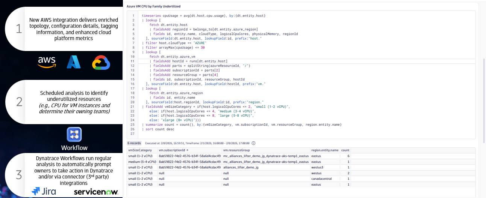

# Lab 2: Monitor Azure Cloud Resources

## 2.6 Forecasting & Auto-Prevention

!!! info "Continue Using Your Own Environment"
    You should still be logged into **your own Dynatrace environment**. The Forecasting features covered in this section work with your Azure VMs monitored by OneAgent.

### Overview

One of the key pillars of Modern Cloud Operations is **Prevention** — automating DevOps and SRE tasks with preventive automation and reacting to health changes before they impact your users.

Davis AI enables you to forecast utilization of cloud resources and foresee potential issues like disk full events before they impact your users.

### Tasks to complete this step

#### Forecast VM Disk Storage in a Notebook

1. Open the Notebooks app
    - In Dynatrace, from the menu on the left, select `Apps -> Notebooks`
    - Create a new notebook or open an existing one

1. Add a DQL section to query disk metrics
    - Click **+ Add section** and select **DQL**
    - Copy and paste the following query to analyze disk free space:

    ```dql title="Forecast disk free space for Azure VMs"
    timeseries avg(dt.host.disk.free), by:{dt.entity.host}
    | lookup [fetch dt.entity.host | fields id, entity.name, cloudType], sourceField:dt.entity.host, lookupField:id, prefix:"host."
    | filter host.cloudType == "AZURE"
    | lookup [
        fetch dt.entity.azure_vm
        | fieldsAdd hostId = runs[dt.entity.host]
        | fields id, entity.name, hostId
      ], sourceField:dt.entity.host, lookupField:hostId, prefix:"vm."
    | fieldsRemove dt.entity.host, host.id, host.entity.name, host.cloudType, vm.id, vm.hostId
    ```

    - Click **Run** to see the current disk utilization for your Azure VMs

1. Add Davis AI forecasting via visualization
    - After running your query, click on **Options** and the **Visualizations** section
    - Select **Line chart** as the visualization type (if not already selected)
    - In the visualization settings, scroll down to **Analyze and Alert** section
    - Enable **AI data analysis** and select:
        - Forecast
        - Accept the defaults that are in there for data points to predict and forecast offset
    - The chart will now display predicted values as a dashed line extending beyond your current data

    

    - Look for any VMs where disk free space is predicted to drop below a critical threshold

    !!! tip "Davis AI Forecasting"
        Davis AI forecasting uses machine learning to predict future values based on historical patterns. The forecast appears as a dashed line on your time series chart, helping you visualize potential issues before they occur.

### Key Takeaways

| Concept | Description |
|---------|-------------|
| **Davis AI Forecasting** | Predicts future resource utilization based on historical patterns |
| **Proactive Monitoring** | Forecasting helps identify potential issues before they impact users |
| **Prevention over Reaction** | Modern Cloud Operations focuses on preventing issues, not just detecting them |

!!! success "Checkpoint"
    Before proceeding to the next section, verify:

    - You created a DQL query to analyze disk utilization
    - You added Davis AI forecasting to predict future values
    - You can identify VMs where disk space may become critical
