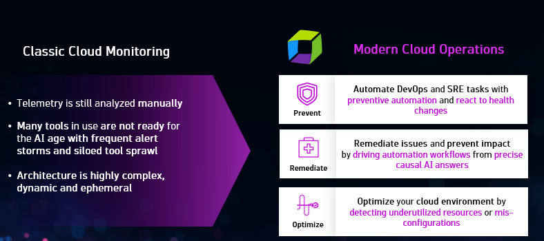

--8<-- "snippets/send-bizevent/2-azure_lab.js"

# Lab 2: Monitor Azure Cloud Resources

## 2.1 Intro

### The Challenge of Modern Cloud Operations

As organizations increasingly adopt cloud-native architectures on Azure, the complexity of monitoring and managing these environments grows exponentially. Traditional siloed approaches to infrastructure monitoring no longer suffice when you're dealing with distributed microservices, serverless functions, managed databases, and containerized workloads—all generating massive amounts of telemetry data.

**Classic Cloud Monitoring challenges:**

- Telemetry is still analyzed **manually**
- Many tools in use are **not ready for the AI age** with frequent alert storms and siloed tool sprawl
- Architecture is highly **complex, dynamic and ephemeral**

**Effective Azure cloud monitoring requires:**

- **Unified observability** across all Azure services—from VMs to AKS to serverless
- **Automatic correlation** of metrics, logs, and traces to reduce mean time to resolution (MTTR)
- **AI-powered anomaly detection** that cuts through the noise and surfaces real issues
- **Context-rich insights** that connect infrastructure health to business impact

### Transform to Modern Cloud Operations

Modern Cloud Operations is about moving from reactive monitoring to proactive, automated cloud operations. This transformation is built on three pillars:

| Pillar | Description |
|--------|-------------|
| **Prevent** | Automate DevOps and SRE tasks with preventive automation and react to health changes |
| **Remediate** | Remediate issues and prevent impact by driving automation workflows from precise causal AI answers |
| **Optimize** | Optimize your cloud environment by detecting underutilized resources or misconfigurations |

This approach is powered by the Dynatrace Platform foundation:

- **Grail** — Unified data lakehouse for all observability telemetry
- **Smartscape** — Real-time context graph that automatically discovers infrastructure, services, and their relationships
- **Dynatrace Intelligence** — Predictive, Causal, and Generative AI for intelligent automation

### Azure Native Dynatrace Integration

With [Azure Native Dynatrace Service](https://www.dynatrace.com/news/blog/using-dynatrace-on-microsoft-azure/), Dynatrace is available as a first-party Azure resource directly in the Azure Portal. This native integration eliminates the traditional complexity of setting up observability pipelines:

| Traditional Approach | Azure Native Integration |
|---------------------|-------------------------|
| Deploy ActiveGate to query Azure Monitor | ✅ Direct metric ingestion |
| Configure Event Hubs for log forwarding | ✅ Native log streaming |
| Manage Azure Functions for data processing | ✅ Zero infrastructure overhead |
| Manual tagging and resource mapping | ✅ Automatic Azure resource discovery |

This seamless integration enables you to focus on what matters—**understanding your cloud environment and optimizing performance**—rather than managing monitoring infrastructure.

### Objectives

By the end of this lab, you will be able to:

🔷 **Understand Azure Monitor integration** - Review how Azure Native Dynatrace Service automatically ingests Azure Monitor metrics without additional infrastructure

🔷 **Navigate the Clouds App** - Use the Dynatrace Clouds app to explore Azure resources, view metrics, logs, and filter services across your cloud environment

🔷 **Analyze logs in context** - Access and filter logs directly from cloud resources, correlating them with metrics for effective troubleshooting

🔷 **Query logs with DQL** - Use Dynatrace Query Language to search and analyze log data across your Azure environment

🔷 **Compare observability perspectives** - Understand the difference between Azure Monitor metrics (Clouds App) and OneAgent metrics (Infrastructure & Operations) to choose the right data for each use case

🔷 **Forecast capacity issues** - Use Dynatrace Intelligence to forecast resource utilization and prevent capacity problems before they impact your environment

### Lab Sections

| Section | Description |
|---------|-------------|
| 2.2 Azure Monitor Flow | How data flows from Azure to Dynatrace |
| 2.3 Clouds App | Explore Azure resources in Dynatrace |
| 2.4 Cloud Resource Analysis | Query and analyze cloud resources with DQL |
| 2.5 Forecasting & Prevention | Predict capacity issues with Dynatrace Intelligence |
| 2.6 Infrastructure & Operations | Explore host metrics and processes via OneAgent |
| 2.7 Summary | Review what you accomplished |
