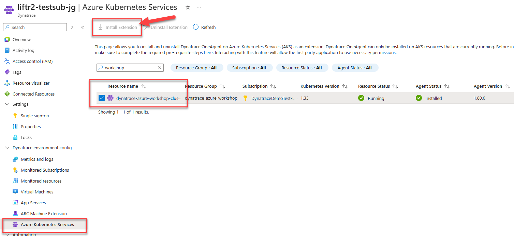
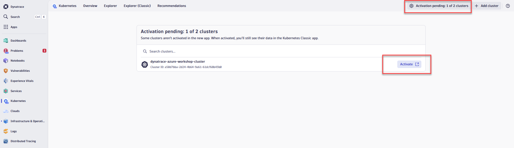

# Lab 3: Azure Kubernetes Observability with Dynatrace

## 3.2 Deploy the Dynatrace Kubernetes Operator via Azure Portal

One key Dynatrace advantage is ease of activation via Azure Portal. OneAgent technology simplifies deployment across large enterprises and relieves engineers of the burden of instrumenting their applications by hand. As Kubernetes adoption continues to grow, it becomes more important than ever to simplify the activation of observability across workloads without sacrificing the deployment automation that Kubernetes provides. Observability should be as cloud-native as Kubernetes itself.

With Azure Native Dynatrace Service, you can install the Dynatrace Operator directly from the Dynatrace resource in Azure Portal - no tokens or manual configuration required.

### Tasks to complete this step

#### Step 1: Install Dynatrace Extension on AKS

1. Open the **Azure Portal** and search for `Dynatrace` in the top search bar

2. Select your **Azure Native Dynatrace Service** resource (e.g., `dt-trial`)

3. From the left navigation menu, scroll down and click on **Azure Kubernetes Services** under the Dynatrace environment config section

4. You will see a list of AKS clusters. Find and select the checkbox next to **dynatrace-azure-workshop-cluster**

    !!! tip
        The cluster should show as "Running" in the Resource Status column and "Not Installed" in the Agent Status column.

5. Click **Install Extension** from the top toolbar

    

6. Wait for the installation to complete. The Agent Status will change to "Installed" once finished.

    !!! warning "Installation Time"
        The extension installation typically takes 2-5 minutes. You can click **Refresh** to check the status.

#### Step 2: Activate the Cluster in Dynatrace

Once the extension is installed, you need to activate the cluster in Dynatrace to start monitoring.

1. Open your **Dynatrace environment** (click "Go to Dynatrace" from Azure Portal or navigate directly)

2. From the left menu, click on **Kubernetes** app

3. At the top of the page, you'll see a banner showing **"Activation pending: 1 of X clusters"** - click on this banner

4. In the activation pending dialog, find **dynatrace-azure-workshop-cluster** and click the **Activate** button next to it

    

5. After activation, return to the **Kubernetes** app. Within a few minutes, you should see your cluster with metrics, nodes, namespaces, and workload data.

    !!! tip
        The New Kubernetes experience provides enhanced visualizations, improved navigation, and additional insights for your Kubernetes workloads.

!!! success "Checkpoint"
    Before proceeding, verify:

    - The Dynatrace extension shows as "Installed" in Azure Portal
    - The cluster is activated in the Dynatrace Kubernetes app
    - You can see cluster nodes and basic metrics in Dynatrace

??? info "Alternative Install Method: Manual Operator Installation"

    If you prefer to install the Dynatrace Operator manually (or if the Azure extension method is unavailable), you can use the following steps:

    **Prerequisites:**

    - You will need the **Dynatrace Operator Token** and **API URL** values saved from Lab 1

    **Manual Installation Steps:**

    1. Open up the Azure Portal and search for the AKS Cluster from the top search bar and select it once it displays under resources

        

    2. Once you're on the AKS cluster, from the left navigation, go to `Settings -> Extensions + Applications`

    3. Click on `Install an extension`

        

    4. Search "Dynatrace" in the search bar. Click on the Dynatrace Operator tile once it's displayed.

        

    5. Click Create at the next screen

    6. On the `Basics` tab, the subscription and resource group should already be pre-selected. Just select the AKS Cluster from the drop down.

        

    7. On the `Dynatrace Operator Configuration` tab, fill in the following values:

        - `AKS extension resource name`: dynatraceazureworkshop
        - `Dynatrace operator token`: token value from notepad saved from Lab 1
        - `Data ingest token`: token value from notepad saved from Lab 1
        - `API URL`: URL value from notepad saved from Lab 1
        - `OneAgent Deployment Type`: cloud native full stack

        

    8. Click on `Review + Create` and click `Create` on the next screen.

    9. After the deployment is complete, follow Step 2 above to activate the cluster in Dynatrace.

        
