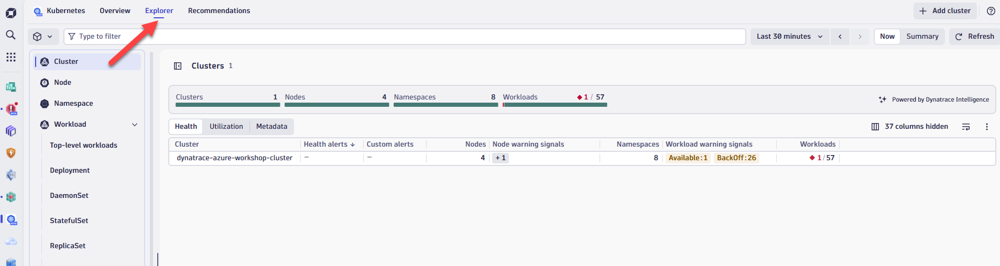
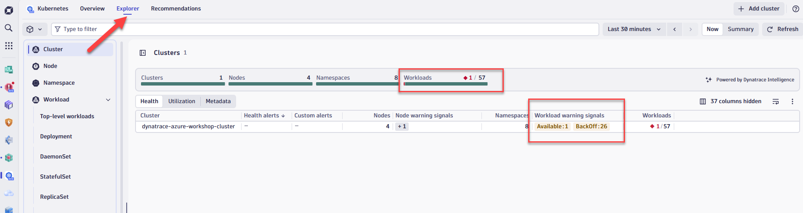
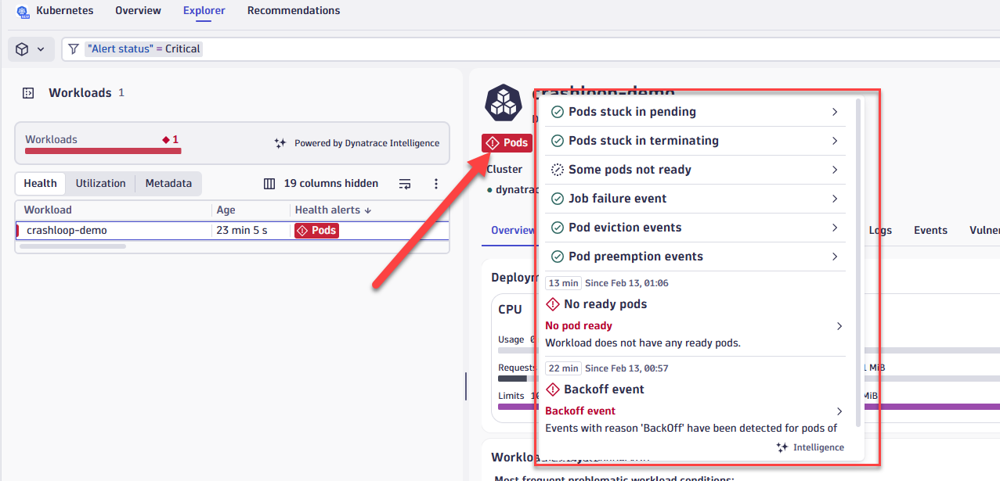
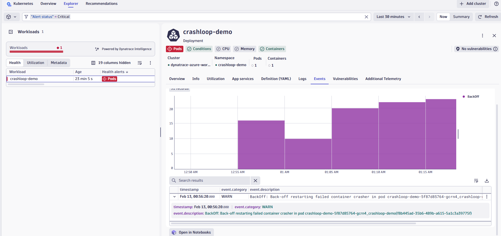
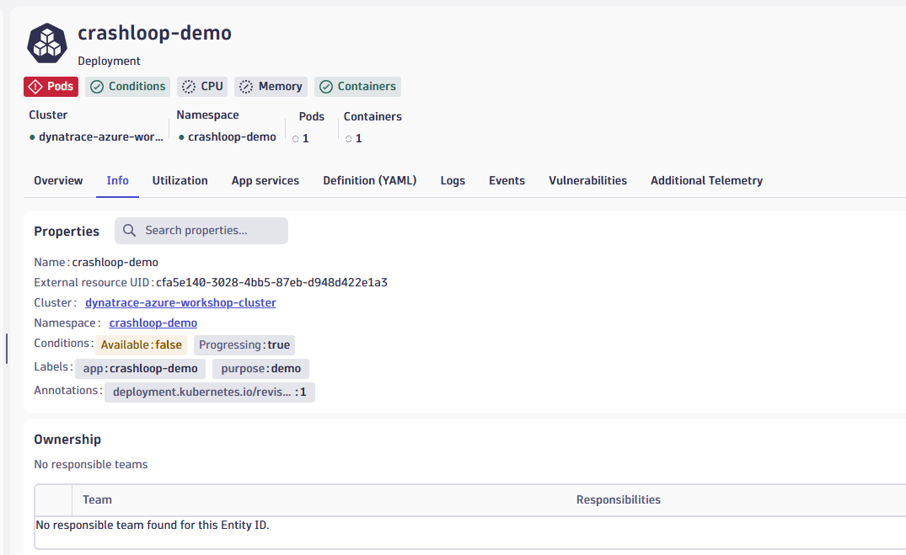
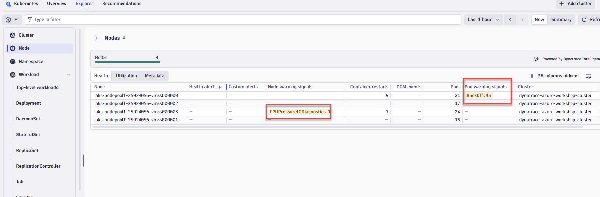

# Lab 3: Azure Kubernetes Observability with Dynatrace

## 3.4 Assess Cluster Health & Performance

### Overview

In this step we will walk through the new Kubernetes experience which is optimized for DevOps Platform Engineers and Site Reliability Engineers (SREs), focusing on the health and performance optimization of multicloud Kubernetes environments.

The underlying metrics, events, and logs are all powered by [Grail](https://docs.dynatrace.com/docs/platform/grail/dynatrace-grail){target="_blank"}, which supports flexible analytics through the [Dynatrace Query Language](https://docs.dynatrace.com/docs/platform/grail/dynatrace-query-language){target="_blank"} in Notebooks, Dashboards, and Workflows.

We will use the Kubernetes app to gain clear insights into cluster health, helping you identify and address issues, and ensuring your clusters are functioning efficiently.

!!! info "Kubernetes App"
    The Kubernetes app provides a unified view of all your Kubernetes clusters across cloud providers (AKS, EKS, GKE, on-premises). It combines metrics, logs, and events in a single interface, making it easier to monitor and troubleshoot your containerized workloads.

### Tasks to complete this step

1. Open the Kubernetes app in Dynatrace
    - From the left navigation menu, select `Apps -> Kubernetes`
    - Alternatively, you should see the Kubernetes app under the `Pinned` section
    

2. Click on **Explorer** from the top menu to view all AKS clusters being monitored
    

3. Select the `dynatrace-azure-workshop-cluster` cluster and review the main screens:

    | Screen | Description |
    |--------|-------------|
    | **Overview** | High-level cluster utilization, node count, workload count, and outstanding problems |
    | **Logs** | Log types (ERROR, WARN, etc.) over time. Click **Run Query** to view the last 100 error/warning details |
    | **Events** | Kubernetes events such as pod scheduling, restarts, and failures |

4. Identify problem workloads in your cluster
    - Select the red number under **Workloads** to filter to unhealthy workloads
    
    

    !!! tip "Quick Problem Identification"
        The red indicators make it easy to spot issues at a glance. Clicking on the count takes you directly to the affected workloads, saving time during incident response.

5. Review Kubernetes events contributing to unhealthiness
    - You will notice events such as **Backoff** events from pods that indicate container restart issues

6. Click on a problem to see root cause details
    - For example, you may see CPU saturation as the cause of node unhealthiness
    

    ??? info "Common Root Causes"
        Dynatrace automatically identifies common Kubernetes issues:

        - **CPU Saturation** — Workloads consuming more CPU than allocated
        - **Memory Pressure** — Nodes running low on available memory
        - **Pod Evictions** — Pods being terminated due to resource constraints
        - **CrashLoopBackOff** — Containers repeatedly failing to start

7. Switch to the **Events** tab to view all Kubernetes events triggered on this workload
    - Look for events like Backoff, Pulled, Created, Started, or Failed
    

8. Review workload metadata on the **Info** tab
    - View namespace, labels, annotations, and other configuration details
    

9. Switch to the **Node** view from the left menu
    - Assess the health of your nodes and identify any additional signals
    - Review node-level metrics such as CPU, memory, and disk utilization
    

10. **(Optional)** Explore additional workload tabs:
    - **Utilization** — CPU and memory consumption over time
    - **Logs** — Container logs for this specific workload
    - **Vulnerability** — Security vulnerabilities detected in container images
    - **Additional Telemetry** — Custom metrics and traces

!!! success "Checkpoint"
    Before proceeding to the next section, verify:

    - You accessed the Kubernetes app and located your cluster
    - You reviewed the cluster Overview, Logs, and Events screens
    - You identified unhealthy workloads and understood the root cause
    - You explored the Node view to assess node health
