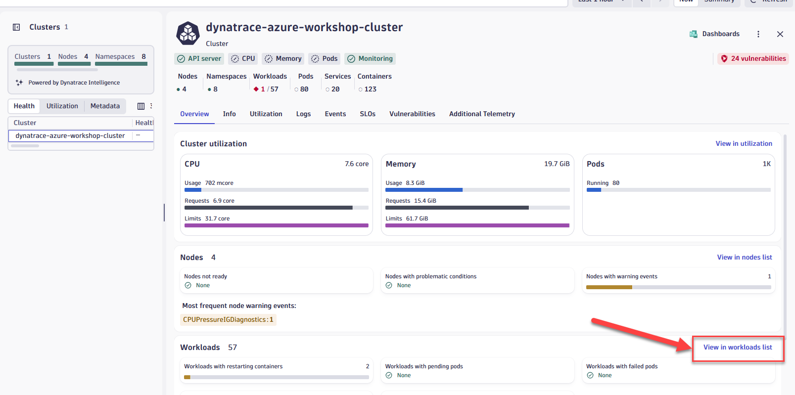
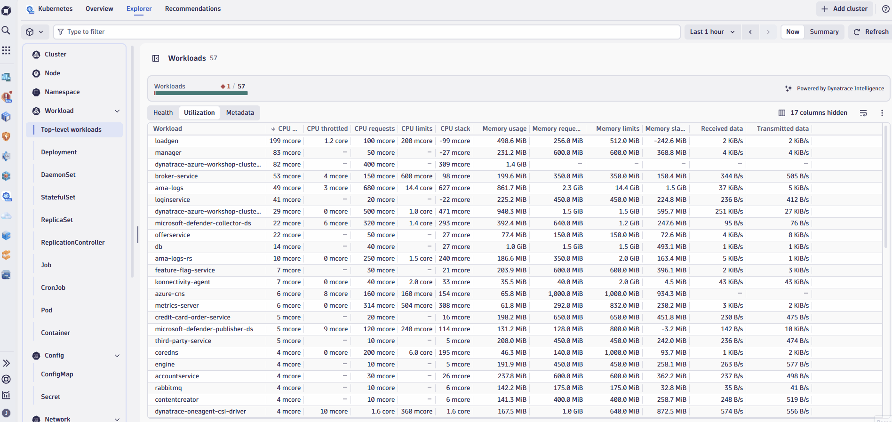
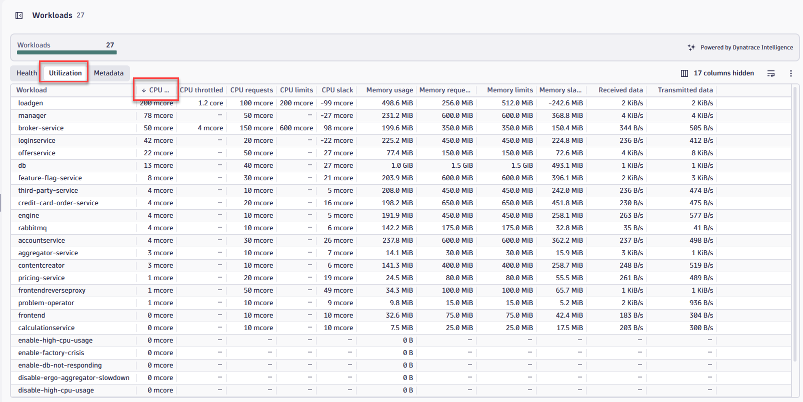
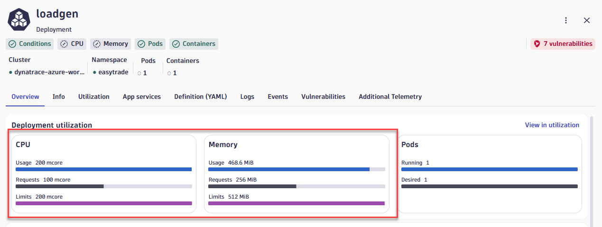

# Lab 3: Azure Kubernetes Observability with Dynatrace

## 3.5 Workload Resource Optimization

### Overview

Maximize your cluster resources and reduce costs by identifying and optimizing underutilized workloads. Leverage the Kubernetes app alongside advanced queries in Notebooks, powered by data from Grail, for precise resource allocation suggestions.

### Tasks to complete this step

1. In Kubernetes app, go to the explorer view and then select the `dtaksworkshop` cluster click on `View workloads list`
    

2. Let's apply a couple of filters: one to look at only healthy workloads, second to look at workloads from the `easyTrade` namespace
    

3. Switch over to the Utilization tab and sort by CPU Usage, ascending
    

4. You will quickly see that the `loadgen` sorts to the top and if you click into it to look at resource utilization details, you'll notice that the service uses 200 millicore of CPU and 468mb of memory, but actually the CPU and memory limits are very close to it.
    

5. Review the utilization charts to verify the consistency of usage patterns over time

6. If you need to identify which workloads lack requests or limits, there's a simple Dynatrace Query Language (DQL) query you can run to identify those:
    - Open the Notebooks app from the left navigation
    - Create a new notebook
    - Add a DQL element and copy/paste the query below

    ```dql title="Find workloads missing CPU/Memory requests"
    fetch dt.entity.cloud_application, from: -30m | fields id, workload.name = entity.name, workload.type = arrayFirst(cloudApplicationDeploymentTypes), cluster.id = clustered_by[dt.entity.kubernetes_cluster], namespace.name = namespaceName
    | lookup [
    fetch dt.entity.kubernetes_cluster, from: -30m | fields id, cluster.name = entity.name, cluster.distribution = kubernetesDistribution, cluster.cluster_id = kubernetesClusterId | limit 20000
    ], sourceField:cluster.id, lookupField:id, fields:{cluster.name}
    | fieldsRemove cluster.id
    | filterOut  namespace.name == "kube-system"
    | lookup [
    timeseries values = sum(dt.kubernetes.container.requests_CPU), by:{dt.entity.cloud_application}, from: -2m, filter: dt.kubernetes.container.type == "app"
    | fieldsAdd requests_CPU = arrayFirst(values)
    | limit 20000
    ], sourceField:id, lookupField:dt.entity.cloud_application, fields:{requests_CPU}
    | lookup [
    timeseries values = sum(dt.kubernetes.container.requests_memory), by:{dt.entity.cloud_application}, from: -2m, filter: dt.kubernetes.container.type == "app"
    | fieldsAdd requests_memory = arrayFirst(values)
    | limit 20000
    ], sourceField:id, lookupField:dt.entity.cloud_application, fields:{requests_memory}
    | filter isNull(requests_CPU) or isNull(requests_memory)
    ```

    

!!! success "Checkpoint"
    Before proceeding to the next section, verify:

    - You accessed the workloads list and applied filters
    - You identified underutilized workloads (e.g., checkoutservice)
    - You understand how to use DQL to find workloads missing resource requests/limits
