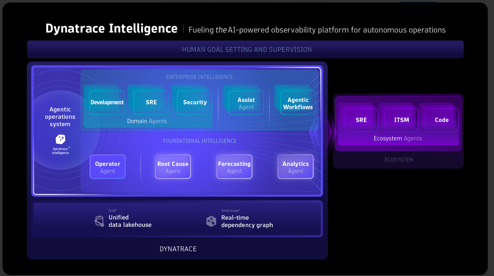
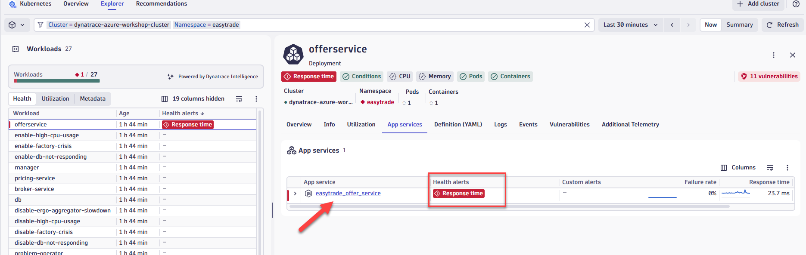
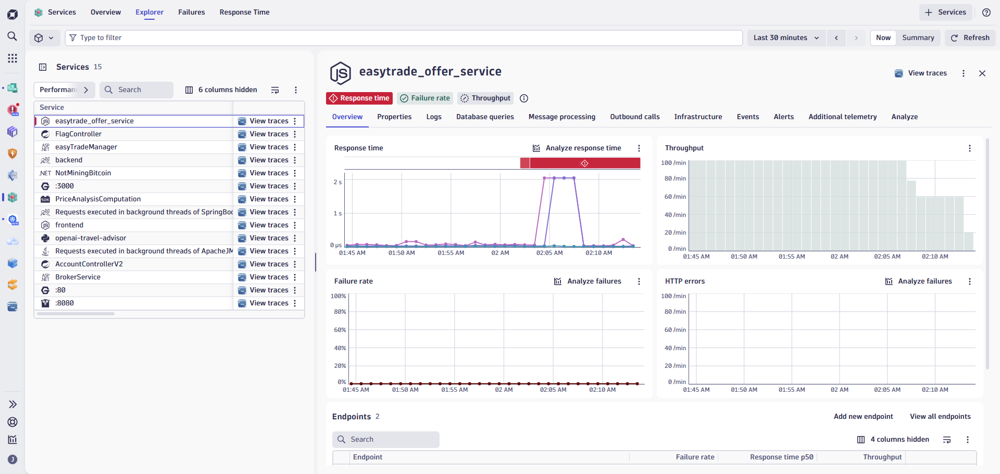
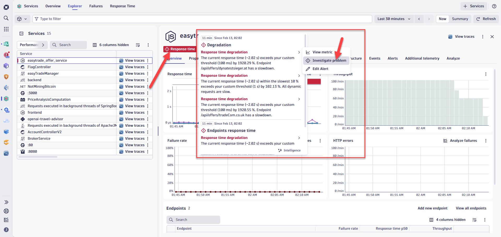
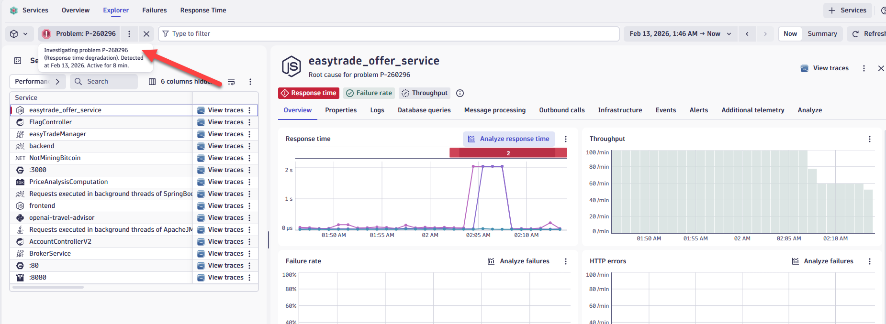
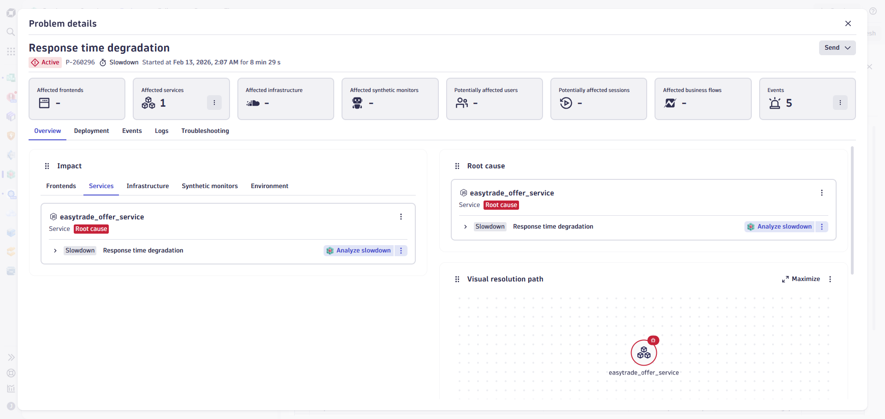

# Lab 3: Azure Kubernetes Observability with Dynatrace

## 3.6 Troubleshoot Workloads with Application Observability

### Overview

Even with a reliable infrastructure, issues can arise, leading to service degradation or, in worst-case scenarios, user-facing errors. The Kubernetes experience offers a suite of tools to visualize and troubleshoot issues, helping to catch problems before they escalate.

Finding the root cause of problems is harder than ever before. The effort required goes beyond what is humanly possible when applications span cloud providers, data centers, and an explosion of interconnected microservices. Traditional monitoring tools simply don't work in the complex ecosystem of Kubernetes.

**Dynatrace Intelligence** fuses deterministic and agentic AI to tackle this exploding complexity. It turns consistent, accurate insights into reliable actions at speed, powered by industry-leading causal AI, the unified Grail data lakehouse, and the Smartscape real-time dependency graph.

Dynatrace Intelligence automatically detects customer-facing issues and uses topology, transaction, and code-level information to pinpoint root cause and recommend remediation actions—using causation, not correlation. Zero manual configuration is needed; auto-baselining starts immediately out of the box, resulting in 90% fewer alerts while still detecting significant anomalies in less than a minute.

In this lab, we will explore problems in our sample app and see how Dynatrace Intelligence dramatically reduces troubleshooting time.

### Tasks to complete this step

1. In the Kubernetes app, go to the Explorer view and select the `dynatrace-azure-workshop-cluster` cluster, then click on **View workloads list**
    

2. Apply a filter to look at workloads from the `easytrade` namespace, then click on the `offerservice` workload.

3. Once you open the workload, you'll see a **Response Time** alert under `App Services`. Click on the `easytrade_offer_service` link.
    

4. The service view shows errors reported for this service over the last hour.
    

5. Explore the Application Observability data in the Offer Service screen:
    - **Service Flow** — Visualize upstream and downstream dependencies
    - **Smartscape view** — See the full topology of related entities
    - **Distributed traces** — Examine code-level hierarchy, errors, and method hotspots

6. Review the problem card that shows root cause. Click on **Response Time** to list the problems Dynatrace has detected, then click on one of the problems and select **Investigate Problem**.
    

7. In the Investigate view, click on **Problem** to view additional details.
    

8. Review the problem card sections:

    | Section | Description |
    |---------|-------------|
    | **Impact** | Displays all impacted Smartscape entities (services, processes, hosts) with brief issue details for each |
    | **Root cause** | Shows detailed information about the affected deployment stack |
    | **Visual resolution path** | Graphically illustrates relationships between frontends, services, and backends involved in the issue |
    | **Automation and remediation** | Lists all automation workflows triggered by the problem (notifications, remediations, external integrations) |

    

    !!! tip "No Manual Configuration Required"
        Dynatrace Intelligence automatically discovers your application topology, learns normal behavior baselines, and detects anomalies—all without any manual threshold configuration. Smart baselining results in 90% fewer alerts while still detecting significant anomalies in less than a minute.

!!! success "Checkpoint"
    Before proceeding to the next section, verify:

    - You found the offerservice workload with the response time problem
    - You navigated to the Services app to view error details
    - You explored Service Flow, Smartscape, and distributed trace details
    - You reviewed the problem card showing root cause analysis powered by Dynatrace Intelligence
