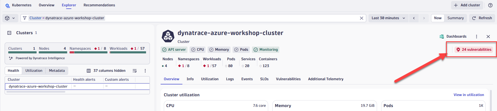
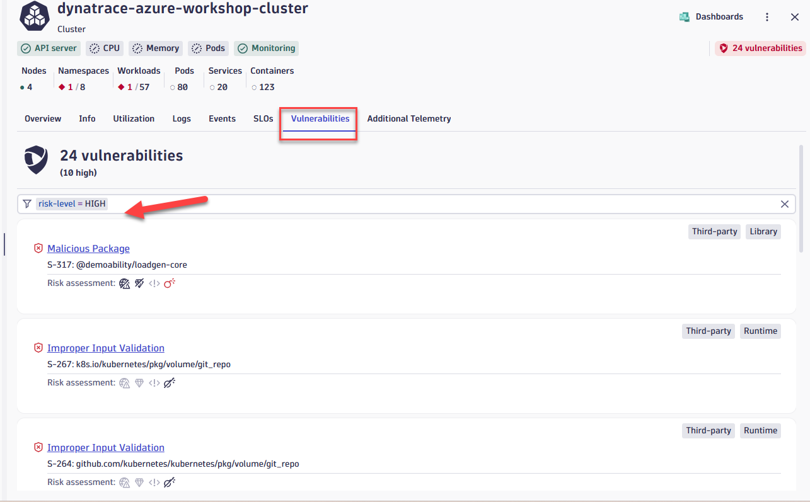
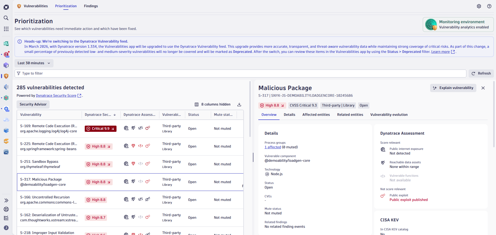

# Lab 3: Azure Kubernetes Observability with Dynatrace

## 3.7 Detect Application Security Vulnerabilities in Workloads

### Overview

Due to the widespread increase in the usage of open-source libraries, modern applications usually contain a large number of vulnerabilities. Evaluating hundreds or thousands of open vulnerabilities quickly becomes a daunting task.

- **Dynatrace Runtime Vulnerability Analytics** is designed to pinpoint vulnerabilities that need immediate investigation. It automatically analyzes data access paths and production execution to provide an automatic risk and impact assessment.

- **Dynatrace Runtime Application Protection** leverages code-level insights and transaction analysis to detect and block attacks on your applications automatically and in real time.

### Tasks to complete this step

1. Bring up the Kubernetes app in Dynatrace by going to left Navigation Menu and select `Apps -> Kubernetes`. Alternatively you should see Kubernetes app also visible under the `Pinned` section
    

2. In Kubernetes app, go to the explorer view and then select the `dynatrace-azure-workshop-cluster` cluster

3. Once you bring up the cluster overview screen you can quickly view the number of vulnerabilities that are associated with this cluster
    

4. Let's filter the vulnerabilities to see if we can quickly pinpoint one with risk level critical
    

5. Let's now click on the high vulnerability to find out additional details about it
    

6. Review the Vulnerability details panel, which includes:

    | Section | Description |
    |---------|-------------|
    | **Risk Level** | The Davis Security Score (DSS) severity rating (Critical, High, Medium, Low) |
    | **CVSS Score** | The industry-standard Common Vulnerability Scoring System base score |
    | **Dynatrace Assessment** | Context-aware risk factors including public internet exposure and data asset reachability |
    | **Affected Processes** | Which workloads and processes are running the vulnerable library |
    | **CISA KEV** | Whether this vulnerability is in the CISA Known Exploited Vulnerabilities catalog |
    | **Remediation** | Recommended actions and patched versions to resolve the vulnerability |

    ??? info "Davis Security Score (DSS) — Smarter Vulnerability Prioritization"
        Modern applications contain hundreds or thousands of open-source libraries, making it impossible to fix every vulnerability. **Davis Security Score (DSS)** helps you focus on what matters most by enhancing the standard CVSS score with environmental context from your actual runtime environment.

        **How DSS improves prioritization:**

        - **Public Internet Exposure** — If a vulnerability requires network access but your service isn't actually exposed, DSS lowers the risk score
        - **Data Asset Reachability** — DSS considers whether sensitive data is reachable from the affected entity
        - **Code Reachability** — Dynatrace analyzes whether the vulnerable code path is actually executed in production

        **DSS Risk Levels:**

        | Score Range | Risk Level |
        |-------------|------------|
        | 9.0 - 10.0 | Critical |
        | 7.0 - 8.9 | High |
        | 4.0 - 6.9 | Medium |
        | 0.1 - 3.9 | Low |

        By reducing the score of vulnerabilities that aren't relevant to your specific environment, DSS helps you focus on the most critical issues and fix them faster.

!!! success "Checkpoint"
    Before proceeding to the next section, verify:

    - You viewed vulnerabilities associated with the cluster
    - You filtered to find critical vulnerabilities
    - You reviewed vulnerability details including risk assessment and remediation guidance
