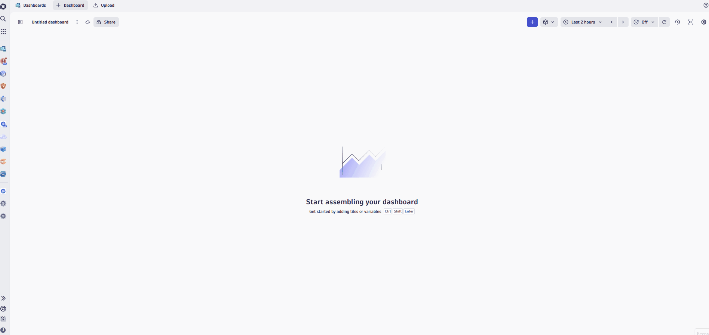

# Lab 4: Dashboards & Notebooks

## 4.2 Dashboards Overview

Get your first fully functional dashboard up and running in minutes with this quick guided tour. We'll show you how to add queries, external data, markdown, and variables—without long explanations or tutorials.

With Dashboards, you can:

- Query, visualize, and observe all your data stored in [Grail](https://www.dynatrace.com/support/help/shortlink/dynatrace-grail).
- Write custom JavaScript with [ad-hoc functions](https://dt-url.net/developer-dashboards) to fetch external data.
- Annotate all your visualizations with markdown to enrich them with context.
- Add variables to filter your results and make your dashboard dynamic.

!!! tip
    🧮 Want to know more about the Dynatrace Query Language?
    🎓 <a href="https://dt-url.net/learndql">Learn DQL </a> at the Dynatrace playground. 🎓


### Tasks to complete this step

#### Explore the Azure Overview Dashboard

1. Open the Dashboards app from the Left Menu
1. In the search bar, type `Azure Overview` and select it from the results
1. Explore the prebuilt dashboard

    !!! info "Azure Overview Dashboard"
        This built-in dashboard provides a high-level overview of your Azure environment, including:

        - **Active Davis Problems by Region** - See where issues are occurring across your Azure regions
        - **Compute Resources** - Insights into Azure VMs and their health status
        - **Non-Compute Resources** - Overview of databases, storage accounts, and serverless environments (Azure Functions, Logic Apps)

        This is a great starting point for getting visibility into your Azure infrastructure without building anything from scratch.

    

#### Create Your Own Dashboard

1. From the Dashboards app, select `+ Dashboard`
1. Select `+` to add dashboard element
1. Select Query Grail.
    
1. In the tile editor for Query, enter the following DQL
    ```
        fetch logs
        | filter cloud.provider == "azure"
        | summarize count(), by:{azure.resource.type}
        | sort `count()`, direction:"descending"
    ```
1. Select Run Query. For logs, your results will be generated in a table by default.
1. Select Select visualization tab to display the results differently.
    

    ??? info "Dashboard Visualization Types"
        You'll notice that not all visualization types are appropriate for the data you've queried. Dynatrace intelligently determines which visualizations make sense for your data and suggests the most suitable options.

!!! success "Checkpoint"
    Before proceeding to the next section, verify:

    - You explored the prebuilt Azure Overview dashboard
    - You created a new dashboard
    - You added a DQL query tile and ran it successfully
    - You explored different visualization options for the query results
