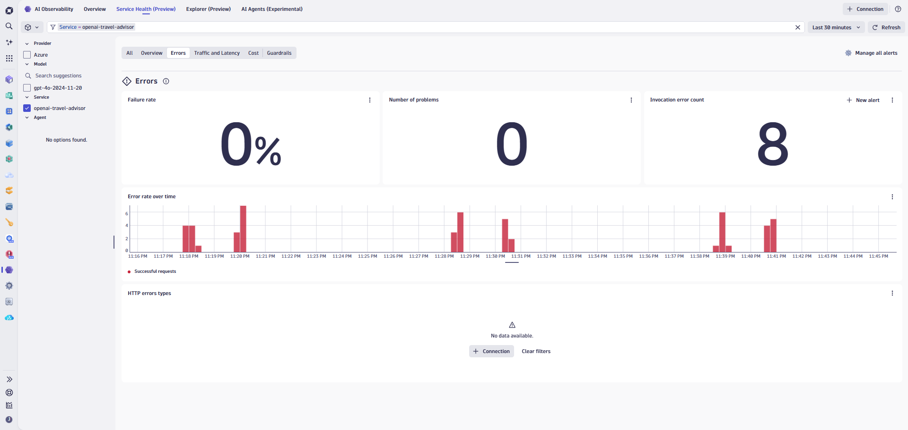
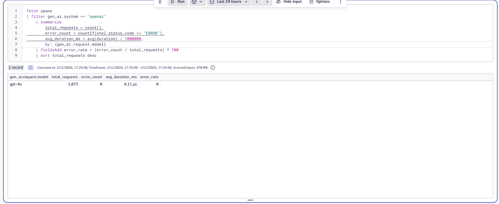
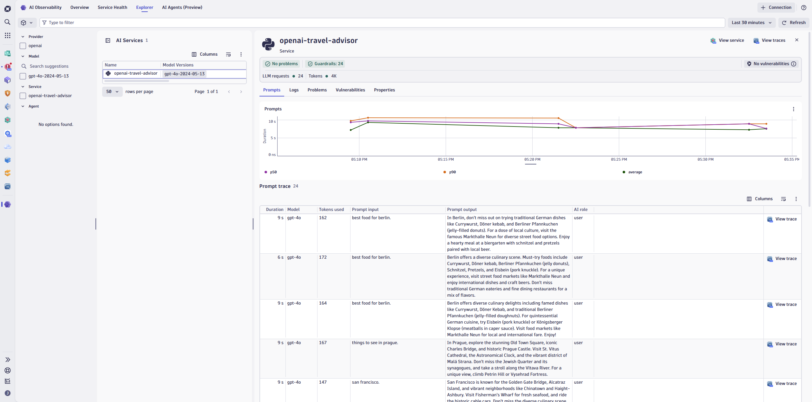

# Lab 5: AI Observability

## 5.3 Monitor LLM Service & Model Health

### Overview

Understanding service and model health is critical for maintaining reliable AI applications. Dynatrace provides real-time visibility into both the overall service health and individual model performance.

### Tasks to complete this step

1. Review service health indicators
    - From the travel-advisor service view, examine:
        - **Success rate** — Percentage of successful model responses
        - **Failure rate** — Frequency of errors or timeouts
        - **Throughput** — Requests per minute/hour
    

2. On the `Overview Tab`, you  can analyze model-specific metrics
    - Number of Models and Agentic agents deployed
    - Number of requests to models 
    - Response time distribution
    - Token usage patterns
    - Overall

3. **(Optional)** Query service health with DQL
    - Open the Notebooks app and create a new notebook
    - Add a DQL section with the following query:

    ```dql title="AI Service Health Summary"
    fetch spans
    | filter gen_ai.system == "openai"
    | summarize
        total_requests = count(),
        error_count = countIf(otel.status_code == "ERROR"),
        avg_duration_ms = avg(duration) / 1000000,
        by: {gen_ai.request.model}
    | fieldsAdd error_rate = (error_count / total_requests) * 100
    | sort total_requests desc
    ```

    

4. Let's now go to the Explorer view and click on `open-ai-travel-advisor` service to look at some of the prompt traces to see what user are putting in prompt to ask our travel-advisor to do.
    

!!! success "Checkpoint"
    Before proceeding to the next section, verify:

    - You reviewed service health indicators (success rate, failure rate, throughput)
    - You analyzed model-specific metrics for at least one model
    - You checked for any Dynatrace Intelligence anomalies
    - (Optional) You ran a DQL query to summarize AI service health
