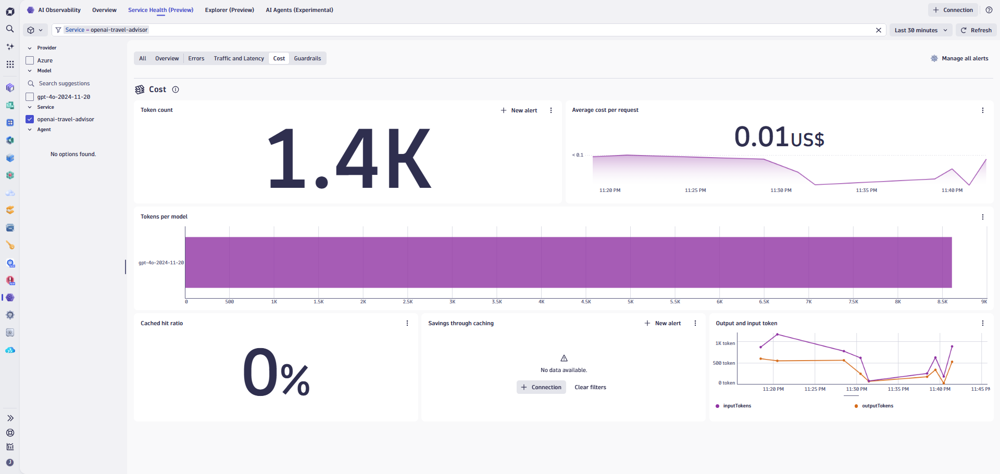

# Lab 5: AI Observability

## 5.4 Analyze Cost and Token Usage

### Overview

Token consumption directly impacts cost when using cloud-based LLM services. Understanding token usage patterns helps optimize costs and identify inefficient prompts or unexpected usage spikes.

### Tasks to complete this step

1. View token consumption metrics
    - From the travel-advisor service view, locate the token metrics:
        - **Input tokens** — Tokens in the prompt sent to the model
        - **Output tokens** — Tokens in the model's response (completion)
        - **Total tokens** — Combined input + output tokens
    

2. Analyze token usage over time
    - Review the token consumption chart to identify:
        - Usage trends (increasing/decreasing)
        - Peak usage periods
        - Unusual spikes

3. Compare token usage across models
    - Different models have different token costs
    - Compare usage between GPT-4 (higher cost) and GPT-3.5 (lower cost)
    - Identify opportunities to use more cost-effective models

4. Identify expensive queries
    - Look for requests with unusually high token counts
    - These may indicate:
        - Overly verbose prompts
        - Unnecessarily long context windows
        - Inefficient prompt engineering

5. **(Optional)** Query token consumption with DQL
    - Add a DQL section in your notebook:

    ```dql title="Token Consumption by Model"
    fetch spans
    | filter ai.technology.vendor == "openai"
    | summarize
        total_input_tokens = sum(ai.prompt_tokens),
        total_output_tokens = sum(ai.completion_tokens),
        total_tokens = sum(ai.total_tokens),
        request_count = count(),
        by: {ai.model.id}
    | fieldsAdd avg_tokens_per_request = total_tokens / request_count
    | sort total_tokens desc
    ```

    !!! tip
        **Cost Optimization Tip:** If you notice high token usage on expensive models like GPT-4, consider whether those requests could be routed to GPT-3.5-turbo for simpler queries while reserving GPT-4 for complex reasoning tasks.
