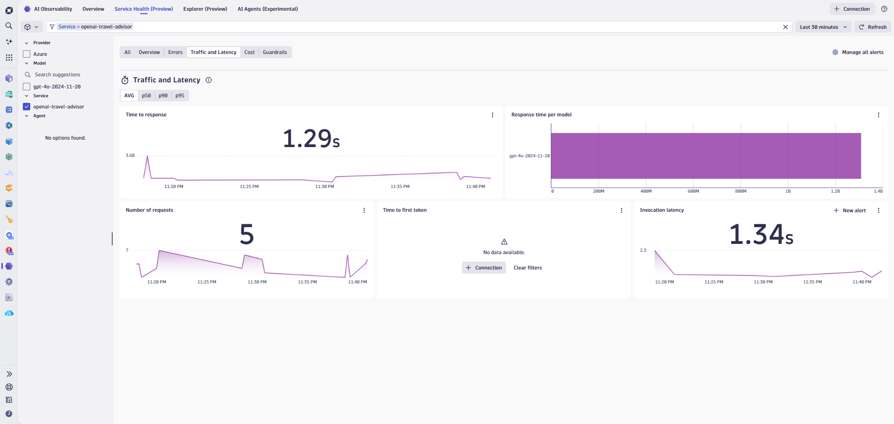

# Lab 5: AI Observability

## 5.5 Troubleshoot Latency Issues

### Overview

Slow LLM responses can significantly impact user experience. Dynatrace helps you identify latency bottlenecks and understand what contributes to slow AI responses.

### Tasks to complete this step

1. Review the latency distribution
    - From the travel-advisor service view, examine the response time chart
    - Look for:
        - Average latency
        - P95/P99 latency (worst-case scenarios)
        - Latency trends over time
    

2. Filter for slow requests
    - Use filters to find requests exceeding acceptable thresholds (e.g., > 5 seconds)
    - Note any patterns in slow requests

3. Analyze latency breakdown
    - For slow requests, examine the contributing factors:
        - **Model processing time** — Time spent by the LLM generating a response
        - **Network latency** — Time for data to travel to/from the AI provider
        - **Queue time** — Time waiting for available capacity

4. Compare latency across models
    - Different models have different response characteristics:
        - GPT-4 typically has higher latency but better quality
        - GPT-3.5-turbo is faster but may produce simpler responses
    - Verify if model selection aligns with latency requirements

5. Identify patterns
    - Look for correlations between latency and:
        - Time of day (peak usage periods)
        - Token count (longer prompts = slower responses)
        - Specific prompt types

    !!! tip
        **Performance Tip:** If latency is critical, consider implementing streaming responses or using faster models for time-sensitive interactions.
