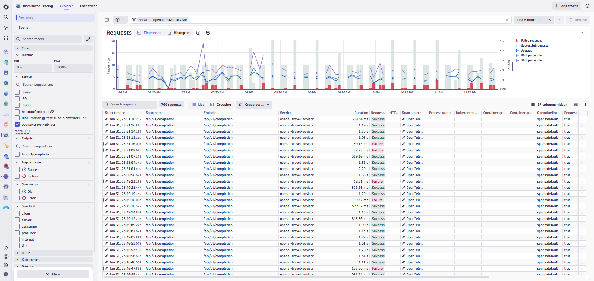
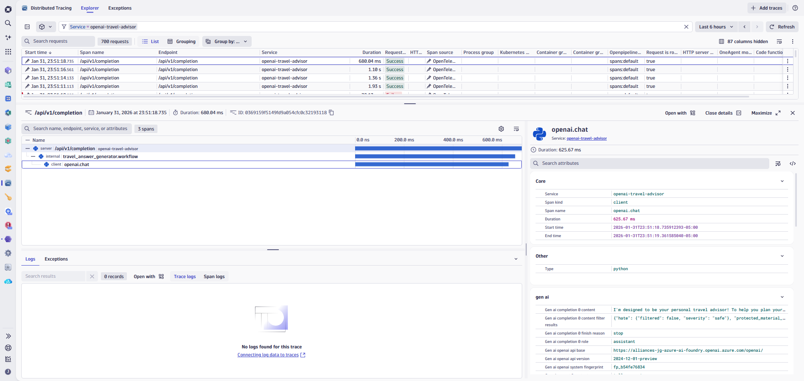
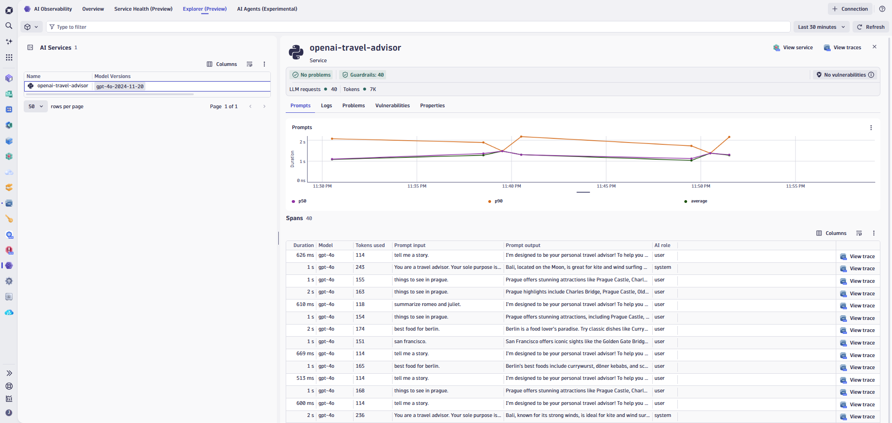

# Lab 5: AI Observability

## 5.6 Explore Traces with Prompts and Responses

### Overview

Distributed tracing provides deep visibility into individual AI requests, including the actual prompts sent to the model and the responses received. This is invaluable for debugging issues, understanding model behavior, and ensuring compliance.

### Tasks to complete this step

1. Navigate to traces
    - From the travel-advisor service view, click on **Distributed traces** or the **Traces** tab
    

2. Select a trace to examine
    - Choose a trace from the list
    - Look for traces with different characteristics:
        - Successful vs. failed requests
        - Fast vs. slow responses
        - High vs. low token usage

3. Examine the trace waterfall
    - The waterfall view shows the request flow:
        - User request received by travel-advisor
        - Prompt constructed and sent to Azure OpenAI
        - LLM processes the request
        - Response received and returned to user
    

4. View prompt and response details
    - Click on the AI span (Azure OpenAI call) to see:
        - **Prompt text** — The full prompt sent to the model
        - **Completion text** — The model's response
        - **Model parameters** — Temperature, max_tokens, etc.
        - **Token counts** — Input, output, and total tokens
    
    

5. Analyze a failed or slow trace
    - Find a trace with an error or high latency
    - Examine:
        - Error messages or exceptions
        - What prompt caused the issue
        - Whether the model returned an unexpected response

6. **(Optional)** Search traces with DQL
    - Query for specific traces based on criteria:

    ```dql title="Find Slow AI Requests"
    fetch spans
    | filter ai.technology.vendor == "openai"
    | filter duration > 5000000000  // > 5 seconds in nanoseconds
    | fields timestamp, ai.model.id, ai.prompt_tokens, ai.completion_tokens, duration
    | sort duration desc
    | limit 20
    ```

    ??? info
        ℹ️ Dynatrace captures prompts and responses for observability and compliance purposes. This provides a complete audit trail of AI interactions, which is essential for regulated industries and responsible AI governance.

!!! success "Checkpoint"
    Before proceeding to the next lab, verify:

    - You navigated to the distributed traces view
    - You examined a trace waterfall showing the AI request flow
    - You viewed prompt and response details in an AI span
    - You analyzed at least one failed or slow trace to understand the issue
