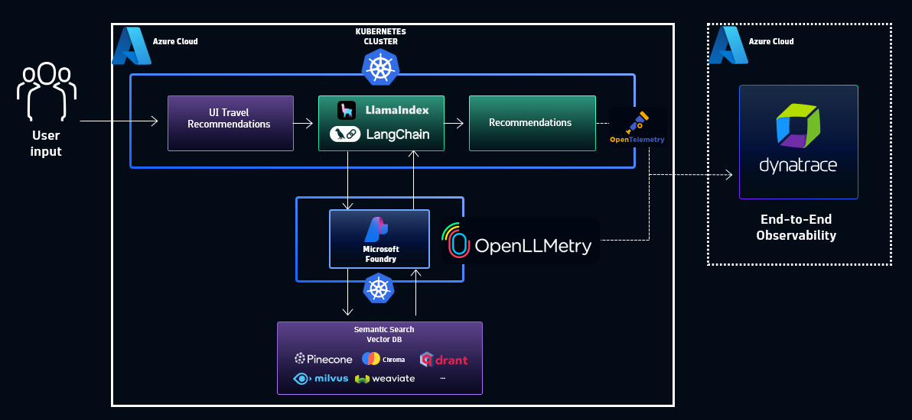
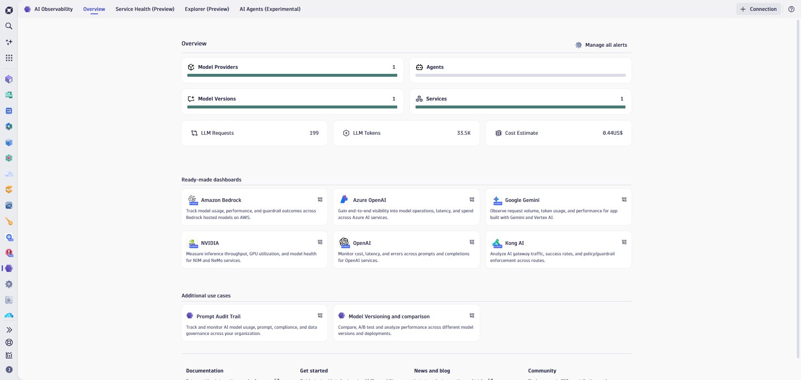
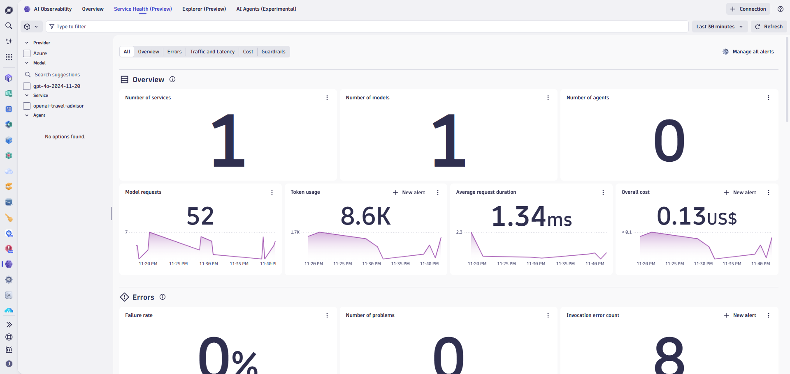

--8<-- "snippets/send-bizevent/5-ai-observability-lab.js"

# Azure Grail Workshop Lab 5 - AI Observability

## 5.1 Intro

### The Challenge of AI in Production

As organizations rapidly adopt generative AI and large language models (LLMs) into their applications, a new set of observability challenges emerges. Traditional monitoring approaches fall short when dealing with AI systems because:

- **Non-deterministic behavior** — Unlike conventional applications, AI models can produce different outputs for the same input
- **Complex dependencies** — Modern AI applications involve multiple models, RAG pipelines, vector databases, and agentic frameworks working together
- **Hidden costs** — Token consumption, API fees, and GPU resources can spiral without proper visibility
- **Quality risks** — Model hallucinations, prompt injection attacks, and data drift can degrade user experience and introduce security vulnerabilities

**AI Observability** is the practice of monitoring, analyzing, and visualizing the internal states, inputs, and outputs of AI models embedded in modern applications—ensuring correctness, reliability, and effectiveness while supporting compliance requirements.

### Dynatrace AI Observability

Dynatrace extends its unified observability platform to provide comprehensive insights into AI applications, helping teams drive reliability, performance, security, and compliance while understanding their AI return on investment (ROI).

| Capability | Description |
|------------|-------------|
| **LLM Monitoring** | Track performance metrics including token consumption, latency, availability, and errors across AI providers |
| **Multi-model Tracing** | Map dependencies between multiple LLMs working with RAG pipelines or agentic frameworks |
| **Input/Output Guardrails** | Detect model hallucinations, prompt injection attempts, PII leakage, and toxic language |
| **Vector Database Monitoring** | Monitor solutions like Milvus, Weaviate, and Qdrant for performance bottlenecks |
| **Cost Tracking** | Visibility into token usage, service fees, and resource consumption |
| **Responsible AI** | Audit trail of every input and output for governance and compliance |



### Key Metrics for AI Applications

Dynatrace monitors critical metrics that determine AI application health:

- **Stability** — Frequency of successful model responses vs. failures
- **Latency** — Time taken by models or services to return results
- **Load** — Volume of requests handled and detection of abnormal spikes/drops
- **Model drift** — Changes in model accuracy due to shifting input data
- **Data drift** — Monitoring input data stationarity over time
- **Cost** — Token usage, service fees, and resource consumption

### Integration with Azure AI Services

Dynatrace integrates with major AI providers including:

- **Azure OpenAI Service** — Monitor GPT models deployed in Azure
- **NVIDIA NIM** — Observe inference microservices
- **OpenAI** — Direct integration with OpenAI APIs
- **Ollama** — Monitor locally deployed models

??? info
    ℹ️ For more details on AI Observability capabilities, see the <a href="https://docs.dynatrace.com/docs/observe/dynatrace-for-ai-observability" target="_blank">Dynatrace AI Observability Documentation</a>.

### Objectives of this Lab

🔷 Explore the AI Observability app and locate AI-powered services

🔷 Monitor LLM service and model health metrics

🔷 Analyze token consumption and cost implications

🔷 Troubleshoot latency issues in LLM responses

🔷 Explore distributed traces to view prompts and responses

## 5.2 Explore the AI Observability App

### Overview

The Dynatrace AI Observability app provides a centralized view of all your AI-powered services, giving you instant visibility into LLM usage, performance, and health across your environment.

In this section, we'll explore the `travel-advisor` service—a sample AI application deployed on Kubernetes that helps users plan trips by leveraging Azure OpenAI.

### Tasks to complete this step

1. Navigate to the AI Observability app
    - In Dynatrace, from the menu on the left, select `Apps -> AI Observability`
    

2. Review the AI Services dashboard
    - The dashboard displays all monitored AI-powered services
    - Note the key metrics shown: request volume, error rate, and token usage
    

3. Locate the travel-advisor service
    - Find the `travel-advisor` service in the list
    - Click on it to open the service detail view

4. Explore the service overview
    - Review the high-level metrics:
        - **Request count** — Total number of AI requests
        - **Error rate** — Percentage of failed requests
        - **Average latency** — Mean response time
        - **Token consumption** — Total tokens used
    

5. View the Models tab
    - Click on the **Models** tab to see which LLM models are being used
    - Note the model distribution (e.g., GPT-4, GPT-3.5-turbo)
    - Review per-model metrics for comparison

## 5.3 Monitor LLM Service & Model Health

### Overview

Understanding service and model health is critical for maintaining reliable AI applications. Dynatrace provides real-time visibility into both the overall service health and individual model performance.

### Tasks to complete this step

1. Review service health indicators
    - From the travel-advisor service view, examine:
        - **Success rate** — Percentage of successful model responses
        - **Failure rate** — Frequency of errors or timeouts
        - **Throughput** — Requests per minute/hour
    

2. Analyze model-specific metrics
    - Click on a specific model (e.g., `gpt-4`) to view:
        - Model availability
        - Error rates by error type
        - Response time distribution
        - Token usage patterns

3. Check for Davis AI anomalies
    - Look for any problems or anomalies flagged by Davis AI
    - Davis automatically detects unusual patterns in:
        - Sudden spikes in error rates
        - Latency degradation
        - Abnormal token consumption

4. **(Optional)** Query service health with DQL
    - Open the Notebooks app and create a new notebook
    - Add a DQL section with the following query:

    ```dql title="AI Service Health Summary"
    fetch spans
    | filter ai.technology.vendor == "openai"
    | summarize
        total_requests = count(),
        error_count = countIf(otel.status_code == "ERROR"),
        avg_duration_ms = avg(duration) / 1000000,
        by: {ai.model.id}
    | fieldsAdd error_rate = (error_count / total_requests) * 100
    | sort total_requests desc
    ```

    

## 5.4 Analyze Cost and Token Usage

### Overview

Token consumption directly impacts cost when using cloud-based LLM services. Understanding token usage patterns helps optimize costs and identify inefficient prompts or unexpected usage spikes.

### Tasks to complete this step

1. View token consumption metrics
    - From the travel-advisor service view, locate the token metrics:
        - **Input tokens** — Tokens in the prompt sent to the model
        - **Output tokens** — Tokens in the model's response (completion)
        - **Total tokens** — Combined input + output tokens
    

2. Analyze token usage over time
    - Review the token consumption chart to identify:
        - Usage trends (increasing/decreasing)
        - Peak usage periods
        - Unusual spikes

3. Compare token usage across models
    - Different models have different token costs
    - Compare usage between GPT-4 (higher cost) and GPT-3.5 (lower cost)
    - Identify opportunities to use more cost-effective models

4. Identify expensive queries
    - Look for requests with unusually high token counts
    - These may indicate:
        - Overly verbose prompts
        - Unnecessarily long context windows
        - Inefficient prompt engineering

5. **(Optional)** Query token consumption with DQL
    - Add a DQL section in your notebook:

    ```dql title="Token Consumption by Model"
    fetch spans
    | filter ai.technology.vendor == "openai"
    | summarize
        total_input_tokens = sum(ai.prompt_tokens),
        total_output_tokens = sum(ai.completion_tokens),
        total_tokens = sum(ai.total_tokens),
        request_count = count(),
        by: {ai.model.id}
    | fieldsAdd avg_tokens_per_request = total_tokens / request_count
    | sort total_tokens desc
    ```

    !!! tip
        **Cost Optimization Tip:** If you notice high token usage on expensive models like GPT-4, consider whether those requests could be routed to GPT-3.5-turbo for simpler queries while reserving GPT-4 for complex reasoning tasks.

## 5.5 Troubleshoot Latency Issues

### Overview

Slow LLM responses can significantly impact user experience. Dynatrace helps you identify latency bottlenecks and understand what contributes to slow AI responses.

### Tasks to complete this step

1. Review the latency distribution
    - From the travel-advisor service view, examine the response time chart
    - Look for:
        - Average latency
        - P95/P99 latency (worst-case scenarios)
        - Latency trends over time
    

2. Filter for slow requests
    - Use filters to find requests exceeding acceptable thresholds (e.g., > 5 seconds)
    - Note any patterns in slow requests

3. Analyze latency breakdown
    - For slow requests, examine the contributing factors:
        - **Model processing time** — Time spent by the LLM generating a response
        - **Network latency** — Time for data to travel to/from the AI provider
        - **Queue time** — Time waiting for available capacity

4. Compare latency across models
    - Different models have different response characteristics:
        - GPT-4 typically has higher latency but better quality
        - GPT-3.5-turbo is faster but may produce simpler responses
    - Verify if model selection aligns with latency requirements

5. Identify patterns
    - Look for correlations between latency and:
        - Time of day (peak usage periods)
        - Token count (longer prompts = slower responses)
        - Specific prompt types

    !!! tip
        **Performance Tip:** If latency is critical, consider implementing streaming responses or using faster models for time-sensitive interactions.

## 5.6 Explore Traces with Prompts and Responses

### Overview

Distributed tracing provides deep visibility into individual AI requests, including the actual prompts sent to the model and the responses received. This is invaluable for debugging issues, understanding model behavior, and ensuring compliance.

### Tasks to complete this step

1. Navigate to traces
    - From the travel-advisor service view, click on **Distributed traces** or the **Traces** tab
    

2. Select a trace to examine
    - Choose a trace from the list
    - Look for traces with different characteristics:
        - Successful vs. failed requests
        - Fast vs. slow responses
        - High vs. low token usage

3. Examine the trace waterfall
    - The waterfall view shows the request flow:
        - User request received by travel-advisor
        - Prompt constructed and sent to Azure OpenAI
        - LLM processes the request
        - Response received and returned to user
    

4. View prompt and response details
    - Click on the AI span (Azure OpenAI call) to see:
        - **Prompt text** — The full prompt sent to the model
        - **Completion text** — The model's response
        - **Model parameters** — Temperature, max_tokens, etc.
        - **Token counts** — Input, output, and total tokens
    
    

5. Analyze a failed or slow trace
    - Find a trace with an error or high latency
    - Examine:
        - Error messages or exceptions
        - What prompt caused the issue
        - Whether the model returned an unexpected response

6. **(Optional)** Search traces with DQL
    - Query for specific traces based on criteria:

    ```dql title="Find Slow AI Requests"
    fetch spans
    | filter ai.technology.vendor == "openai"
    | filter duration > 5000000000  // > 5 seconds in nanoseconds
    | fields timestamp, ai.model.id, ai.prompt_tokens, ai.completion_tokens, duration
    | sort duration desc
    | limit 20
    ```

    ??? info
        ℹ️ Dynatrace captures prompts and responses for observability and compliance purposes. This provides a complete audit trail of AI interactions, which is essential for regulated industries and responsible AI governance.

## Summary

In this section, you should have completed the following:

✅ Explored the AI Observability app and located AI-powered services

✅ Monitored LLM service and model health metrics

✅ Analyzed token consumption and cost implications

✅ Troubleshot latency issues in LLM responses

✅ Explored distributed traces to view prompts and responses

✅ Used DQL to query AI observability data in Notebooks

